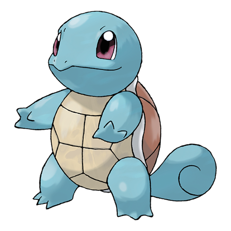

---
title: "Squirtle (#0007)"
category: Pokedex
tags: [squirtle, kanto, water]
image: "assets/images/pokemon/007.png"
---

# Squirtle (#0007)

*Tiny turtle Pokemon*

**Type:** Water
**Abilities:** [[Torrent]], [[Rain Dish]] *(Hidden)*
**Base HP:** 3

> It is scarce in the wild. The shell is not just for protection - it also helps to minimize resistance in water enabling Squirtle to swim at high speeds. It’s usually a calm and easy going Pokemon.

---

## Statistiche (Attributes & Limits)

| Attribute | Base / Limit |
|---|---|
| **Strength** | 2/4 |
| **Dexterity** | 1/3 |
| **Vitality** | 2/4 |
| **Special** | 2/4 |
| **Insight** | 2/4 |

---

## Mosse (Learnset)

- **Starter:** [[Tackle]], [[Tail_Whip]]
- **Beginner:** [[Water_Gun]], [[Withdraw]]
- **Amateur:** [[Bubble]], [[Bite]], [[Rapid_Spin]], [[Protect]], [[Water_Pulse]], [[Aqua_Tail]]
- **Ace:** [[Skull_Bash]], [[Iron_Defense]], [[Rain_Dance]], [[Hydro_Pump]]
- **Pro:** [[Aqua_Jet]], [[Water_Pledge]], [[Icy_Wind]]

---

## Correlati

### Catena Evolutiva
- [[0008_Wartortle|Wartortle]]
- [[0009_Blastoise|Blastoise]]
