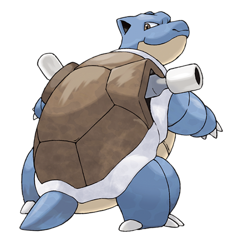
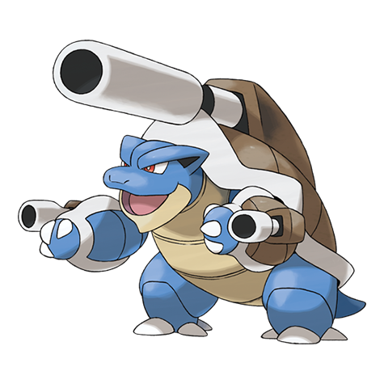
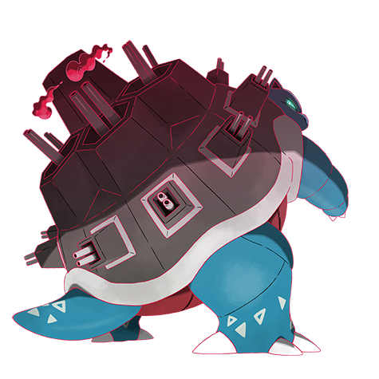

---
title: "Blastoise (#0009)"
category: Pokedex
tags: [blastoise, kanto, water]
image: "assets/images/pokemon/009.png"
---

# Blastoise (#0009)

*Shellfish Pokemon*

**Type:** Water
**Abilities:** [[Torrent]], [[Rain Dish]] *(Hidden)*
**Base HP:** 5

> The jets of water it spouts from the rocket cannons on its shell have been recorded to punch through steel. It is confident on its great defense and water spouts to overcome any obstacle.

---

## Statistiche (Attributes & Limits)

| Attribute | Base / Limit |
|---|---|
| **Strength** | 2/5 |
| **Dexterity** | 2/5 |
| **Vitality** | 3/6 |
| **Special** | 2/5 |
| **Insight** | 3/6 |

---

## Mosse (Learnset)

- **Starter:** [[Tail_Whip]], [[Tackle]]
- **Beginner:** [[Withdraw]], [[Water_Gun]]
- **Amateur:** [[Rapid_Spin]], [[Bubble]], [[Bite]], [[Flash_Cannon]], [[Protect]], [[Water_Pulse]], [[Aqua_Tail]]
- **Ace:** [[Skull_Bash]], [[Iron_Defense]], [[Rain_Dance]], [[Hydro_Pump]]
- **Pro:** [[Zap_Cannon]], [[Outrage]], [[Hydro_Cannon]]

---

## Forme Speciali

### Mega Blastoise

**Type:** Water  
**Ability:** [[Mega_Launcher|Mega Launcher]]  
**Base HP:** 6  ·  **Suggested Rank:** Pro  
**Height:** 1.6m / 5'03"  ·  **Weight:** 200kg / 440lbs

> With the power of the Mega Stone the cannon on its back can shoot exploding water projectiles that can pierce through concrete. Its body is incredibly hard and its hind legs root themselves to prevent recoil.

 

---

### Blastoise (Gigantamax)

*Forma Gigantamax — richiede Dynamax Band e Pokémon Stadium, oppure Power Spot naturale.*

Vedi [[Max_Moves]] per le G-Max Moves disponibili e i relativi effetti.

 

---

## Correlati

### Catena Evolutiva
- [[0007_Squirtle|Squirtle]]
- [[0008_Wartortle|Wartortle]]
