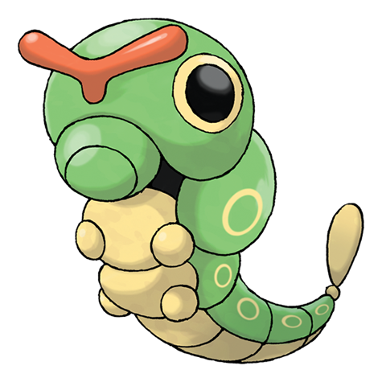

---
title: "Caterpie (#0010)"
category: Pokedex
tags: [caterpie, kanto, bug]
image: "assets/images/pokemon/010.png"
---

# Caterpie (#0010)

*Worm Pokemon*

**Type:** Bug
**Abilities:** [[Shield Dust]], [[Run_Away]] *(Hidden)*
**Base HP:** 3

> It is very common in the forests. Its voracious appetite compels it to devour leaves bigger than itself without hesitation. It releases a foul odor from its antennae if it feels threatened.

---

## Statistiche (Attributes & Limits)

| Attribute | Base / Limit |
|---|---|
| **Strength** | 1/3 |
| **Dexterity** | 2/4 |
| **Vitality** | 1/3 |
| **Special** | 1/3 |
| **Insight** | 1/3 |

---

## Mosse (Learnset)

- **Starter:** [[Tackle]], [[String_Shot]]
- **Beginner:** [[Bug_Bite]]
- **Amateur:** [[Electroweb]]

---

## Correlati

### Catena Evolutiva
- [[0011_Metapod|Metapod]]
- [[0012_Butterfree|Butterfree]]
