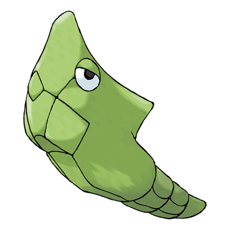

---
title: "Metapod (#0011)"
category: Pokedex
tags: [metapod, kanto, bug]
image: "assets/images/pokemon/011.png"
---

# Metapod (#0011)

*Cocoon Pokemon*

**Type:** Bug
**Abilities:** [[Shed Skin]]
**Base HP:** 4

> Its shell can be as hard as an iron slab. A Metapod does not move very much because it is preparing its soft innards for evolution inside the shell. It is known as one of the fastest evolving Pokemon in the world.

---

## Statistiche (Attributes & Limits)

| Attribute | Base / Limit |
|---|---|
| **Strength** | 1/3 |
| **Dexterity** | 1/3 |
| **Vitality** | 2/4 |
| **Special** | 1/3 |
| **Insight** | 1/3 |

---

## Mosse (Learnset)

- **Starter:** [[Harden]]
- **Amateur:** [[Iron_Defense]], [[Electroweb]]

---

## Correlati

### Catena Evolutiva
- [[0010_Caterpie|Caterpie]]
- [[0012_Butterfree|Butterfree]]
