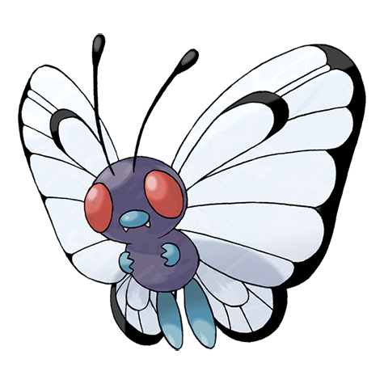
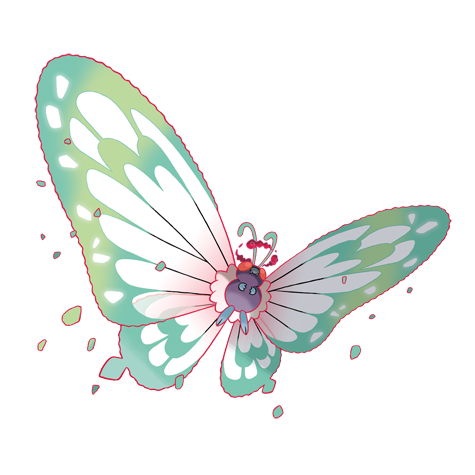

---
title: "Butterfree (#0012)"
category: Pokedex
tags: [butterfree, kanto, bug, flying]
image: "assets/images/pokemon/012.png"
---

# Butterfree (#0012)

*Butterfly Pokemon*

**Type:** Bug / Flying
**Abilities:** [[Compound Eyes]], [[Tinted Lens]] *(Hidden)*
**Base HP:** 5

> It can be found in forests and plains. It loves the honey in some flowers even with tiny amounts of pollen. Its wings are covered by dust that allows it to fly even when it’s raining.

---

## Statistiche (Attributes & Limits)

| Attribute | Base / Limit |
|---|---|
| **Strength** | 2/4 |
| **Dexterity** | 2/5 |
| **Vitality** | 2/4 |
| **Special** | 2/5 |
| **Insight** | 2/5 |

---

## Mosse (Learnset)

- **Starter:** [[Confusion]], [[Gust]]
- **Beginner:** [[Stun_Spore]], [[Sleep_Powder]], [[Poison_Powder]]
- **Amateur:** [[Supersonic]], [[Whirlwind]], [[Psybeam]], [[Silver_Wind]], [[Tailwind]], [[Rage_Powder]], [[Captivate]]
- **Ace:** [[Safeguard]], [[Electroweb]], [[Air_Slash]], [[Quiver_Dance]]
- **Pro:** [[Nightmare]], [[Signal_Beam]], [[Bug_Buzz]]

---

## Forme Speciali

### Butterfree (Gigantamax)

*Forma Gigantamax — richiede Dynamax Band e Pokémon Stadium, oppure Power Spot naturale.*

Vedi [[Max_Moves]] per le G-Max Moves disponibili e i relativi effetti.

 

---

## Correlati

### Catena Evolutiva
- [[0010_Caterpie|Caterpie]]
- [[0011_Metapod|Metapod]]
