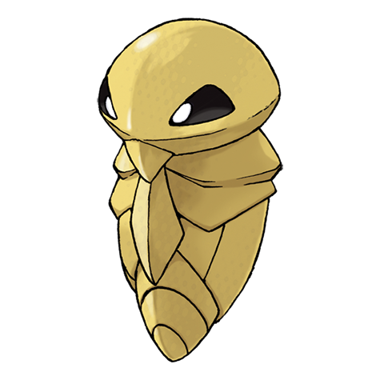

---
title: "Kakuna (#0014)"
category: Pokedex
tags: [kakuna, kanto, bug, poison]
image: "assets/images/pokemon/014.png"
---

# Kakuna (#0014)

*Cocoon Pokemon*

**Type:** Bug / Poison
**Abilities:** [[Shed Skin]]
**Base HP:** 4

> It remains virtually immobile while it clings to a tree. On the inside, it is preparing for evolution by rising the temperature of its shell. Beware of Beedrills that may roam close to it.

---

## Statistiche (Attributes & Limits)

| Attribute | Base / Limit |
|---|---|
| **Strength** | 1/3 |
| **Dexterity** | 1/3 |
| **Vitality** | 2/4 |
| **Special** | 1/3 |
| **Insight** | 1/3 |

---

## Mosse (Learnset)

- **Starter:** [[Harden]]
- **Amateur:** [[Iron_Defense]], [[Electroweb]]

---

## Correlati

### Catena Evolutiva
- [[0013_Weedle|Weedle]]
- [[0015_Beedrill|Beedrill]]
