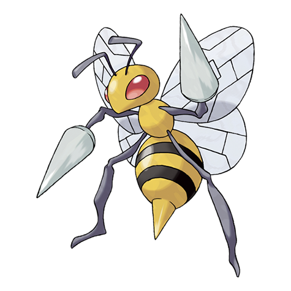
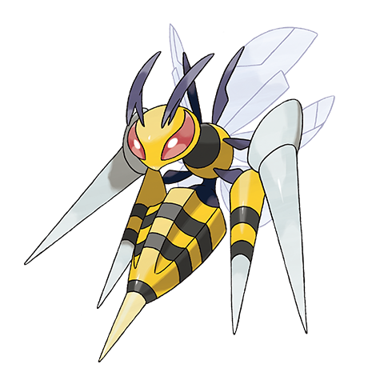

---
title: "Beedrill (#0015)"
category: Pokedex
tags: [beedrill, kanto, bug, poison]
image: "assets/images/pokemon/015.png"
---

# Beedrill (#0015)

*Poison Bee Pokemon*

**Type:** Bug / Poison
**Abilities:** [[Swarm]], [[Sniper]] *(Hidden)*
**Base HP:** 5

> Beedrill are extremely territorial. For safety reasons, no one should ever approach their nest. If disturbed, they will attack in swarm. It has three stings. The one on its tail secretes a powerful poison.

---

## Statistiche (Attributes & Limits)

| Attribute | Base / Limit |
|---|---|
| **Strength** | 2/5 |
| **Dexterity** | 2/5 |
| **Vitality** | 2/4 |
| **Special** | 2/4 |
| **Insight** | 2/5 |

---

## Mosse (Learnset)

- **Starter:** [[Fury_Attack]]
- **Beginner:** [[Focus_Energy]], [[Twineedle]]
- **Amateur:** [[Rage]], [[Pursuit]], [[Venoshock]], [[Toxic_Spikes]], [[Pin_Missile]], [[Agility]]
- **Ace:** [[Assurance]], [[Poison_Jab]], [[Ominous_Wind]], [[Fell_Stinger]]
- **Pro:** [[Drill_Run]], [[Tailwind]], [[Endeavor]]

---

## Forme Speciali

<strong>Mega Beedrill</strong>

---

## Correlati

### Catena Evolutiva
- [[0013_Weedle|Weedle]]
- [[0014_Kakuna|Kakuna]]
