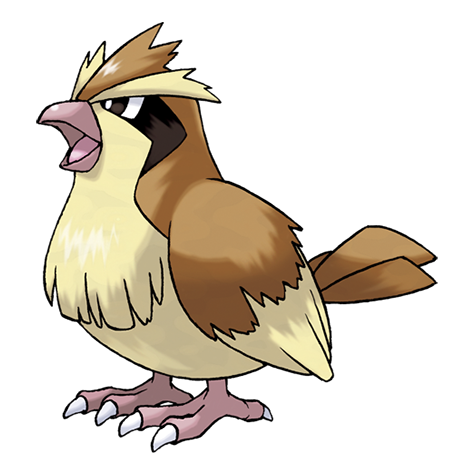

---
title: "Pidgey (#0016)"
category: Pokedex
tags: [pidgey, kanto, normal, flying]
image: "assets/images/pokemon/016.png"
---

# Pidgey (#0016)

*Tiny Bird Pokemon*

**Type:** Normal / Flying
**Abilities:** [[Keen Eye]], [[Tangled Feet]], [[Big Pecks]] *(Hidden)*
**Base HP:** 3

> Very common around the world, it prefers to live in forests but can be seen around cities and plains too. It’s a docile Pokemon that tends to avoid trouble. It flaps its wings to lure prey out of hiding.

---

## Statistiche (Attributes & Limits)

| Attribute | Base / Limit |
|---|---|
| **Strength** | 2/4 |
| **Dexterity** | 2/4 |
| **Vitality** | 1/3 |
| **Special** | 1/3 |
| **Insight** | 1/3 |

---

## Mosse (Learnset)

- **Starter:** [[Tackle]], [[Sand_Attack]]
- **Beginner:** [[Gust]], [[Twister]]
- **Amateur:** [[Whirlwind]], [[Quick_Attack]], [[Feather_Dance]], [[Agility]], [[Wing_Attack]], [[Mirror_Move]]
- **Ace:** [[Tailwind]], [[Roost]], [[Air_Slash]], [[Hurricane]]
- **Pro:** [[Feint_Attack]], [[Uproar]], [[Steel_Wing]]

---

## Correlati

### Catena Evolutiva
- [[0017_Pidgeotto|Pidgeotto]]
- [[0018_Pidgeot|Pidgeot]]
