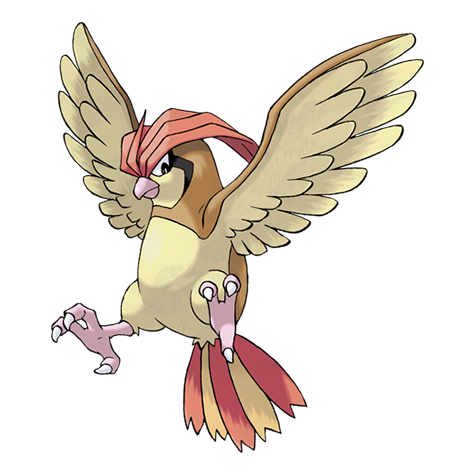

---
title: "Pidgeotto (#0017)"
category: Pokedex
tags: [pidgeotto, kanto, normal, flying]
image: "assets/images/pokemon/017.png"
---

# Pidgeotto (#0017)

*Bird Pokemon*

**Type:** Normal / Flying
**Abilities:** [[Keen Eye]], [[Tangled Feet]], [[Big Pecks]] *(Hidden)*
**Base HP:** 4

> Each Pidgeotto claims a large meadow area as its territory. This Pokemon flies around, patrolling its home and will attack any intruders with its sharp claws. It will challenge itself to fly a bit higher every day.

---

## Statistiche (Attributes & Limits)

| Attribute | Base / Limit |
|---|---|
| **Strength** | 2/4 |
| **Dexterity** | 2/5 |
| **Vitality** | 2/4 |
| **Special** | 2/4 |
| **Insight** | 2/4 |

---

## Mosse (Learnset)

- **Starter:** [[Tackle]], [[Sand_Attack]]
- **Beginner:** [[Gust]], [[Twister]]
- **Amateur:** [[Whirlwind]], [[Quick_Attack]], [[Feather_Dance]], [[Agility]], [[Wing_Attack]], [[Mirror_Move]]
- **Ace:** [[Tailwind]], [[Roost]], [[Air_Slash]], [[Feint_Attack]]
- **Pro:** [[Hurricane]], [[Uproar]], [[Steel_Wing]]

---

## Correlati

### Catena Evolutiva
- [[0016_Pidgey|Pidgey]]
- [[0018_Pidgeot|Pidgeot]]
