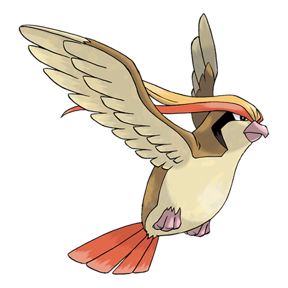

# Pidgeot (Mega Form) (#0018M1)

*Bird Pokemon*

**Type:** Normale / Volante
**Abilities:** [[No Guard]]
**Base HP:** 6

> With the power of the Mega Stone Pidgeot's flying becomes a blurred red stripe in the sky. It won’t stop soaring the skies while in this state without tiring or needing to rest for many days at a time.

---

## Statistiche (Attributes & Limits)

| Attribute | Base / Limit |
|---|---|
| **Strength** | 2/5 |
| **Dexterity** | 3/7 |
| **Vitality** | 2/5 |
| **Special** | 3/7 |
| **Insight** | 2/5 |

---

## Mosse (Learnset)

- **Starter:** [[Sand_Attack|Sand Attack]], [[Tackle|Tackle]]
- **Beginner:** [[Twister|Twister]], [[Gust|Gust]]
- **Amateur:** [[Quick_Attack|Quick Attack]], [[Whirlwind|Whirlwind]], [[Ominous_Wind|Ominous Wind]], [[Feather_Dance|Feather Dance]], [[Agility|Agility]], [[Wing_Attack|Wing Attack]], [[Mirror_Move|Mirror Move]]
- **Ace:** [[Roost|Roost]], [[Tailwind|Tailwind]]
- **Pro:** [[Heat_Wave|Heat Wave]], [[Hurricane|Hurricane]], [[Reflect|Reflect]]

---
