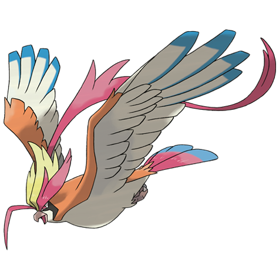

---
title: "Pidgeot (#0018)"
category: Pokedex
tags: [pidgeot, kanto, normal, flying]
image: "assets/images/pokemon/018.png"
---

# Pidgeot (#0018)

*Bird Pokemon*

**Type:** Normal / Flying
**Abilities:** [[Keen Eye]], [[Tangled Feet]], [[Big Pecks]] *(Hidden)*
**Base HP:** 5

> This Pokemon’s plumage is made of beautiful glossy feathers. Pidgeot is an excellent hunter with well developed wing muscles that make it strong enough to whip up a gusty windstorm with just a few flaps.

---

## Statistiche (Attributes & Limits)

| Attribute | Base / Limit |
|---|---|
| **Strength** | 2/5 |
| **Dexterity** | 3/6 |
| **Vitality** | 2/5 |
| **Special** | 2/5 |
| **Insight** | 2/5 |

---

## Mosse (Learnset)

- **Starter:** [[Sand_Attack]], [[Tackle]]
- **Beginner:** [[Twister]], [[Gust]]
- **Amateur:** [[Quick_Attack]], [[Whirlwind]], [[Ominous_Wind]], [[Feather_Dance]], [[Agility]], [[Wing_Attack]], [[Mirror_Move]]
- **Ace:** [[Roost]], [[Tailwind]]
- **Pro:** [[Heat_Wave]], [[Hurricane]], [[Reflect]]

---

## Forme Speciali

<strong>Mega Pidgeot</strong>

---

## Correlati

### Catena Evolutiva
- [[0016_Pidgey|Pidgey]]
- [[0017_Pidgeotto|Pidgeotto]]
