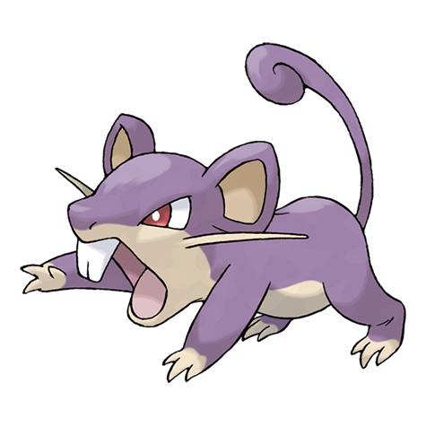

---
title: "Rattata (#0019)"
category: Pokedex
tags: [rattata, kanto, normal]
image: "assets/images/pokemon/019.png"
---

# Rattata (#0019)

*Mouse Pokemon*

**Type:** Normal
**Abilities:** [[Run_Away]], [[Guts]], [[Hustle]] *(Hidden)*
**Base HP:** 3

> It can live anywhere it can find food, but they are often in cities and fields. They form large families in their burrows. Since they are often preyed on, Rattatas are always alert and quick to flee.

---

## Statistiche (Attributes & Limits)

| Attribute | Base / Limit |
|---|---|
| **Strength** | 2/4 |
| **Dexterity** | 2/5 |
| **Vitality** | 1/3 |
| **Special** | 1/3 |
| **Insight** | 1/3 |

---

## Mosse (Learnset)

- **Starter:** [[Tackle]], [[Tail_Whip]]
- **Beginner:** [[Quick_Attack]], [[Focus_Energy]], [[Bite]]
- **Amateur:** [[Pursuit]], [[Hyper_Fang]], [[Sucker_Punch]], [[Assurance]]
- **Ace:** [[Crunch]], [[Super_Fang]], [[Double-Edge]], [[Endeavor]]
- **Pro:** [[Flame_Wheel]], [[Screech]], [[Iron_Tail]]

---

## Correlati

### Catena Evolutiva
- [[0020_Raticate|Raticate]]

---

## Rattata (Forma Alola) (#0019A)

**Type:** Buio / Normale
**Abilities:** [[Gluttony]], [[Hustle]], [[Thick Fat]] *(Hidden)*
**Base HP:** 3

| Attribute | Base / Limit |
|---|---|
| **Strength** | 2/4 |
| **Dexterity** | 2/5 |
| **Vitality** | 1/3 |
| **Special** | 1/3 |
| **Insight** | 1/3 |

### Mosse

- **Starter:** [[Tackle|Tackle]], [[Tail_Whip|Tail Whip]]
- **Beginner:** [[Quick_Attack|Quick Attack]], [[Focus_Energy|Focus Energy]], [[Bite|Bite]]
- **Amateur:** [[Pursuit|Pursuit]], [[Hyper_Fang|Hyper Fang]], [[Sucker_Punch|Sucker Punch]], [[Assurance|Assurance]]
- **Ace:** [[Crunch|Crunch]], [[Super_Fang|Super Fang]], [[Double_Edge|Double-Edge]], [[Endeavor|Endeavor]]
- **Pro:** [[Reversal|Reversal]], [[Snatch|Snatch]], [[Switcheroo|Switcheroo]]
