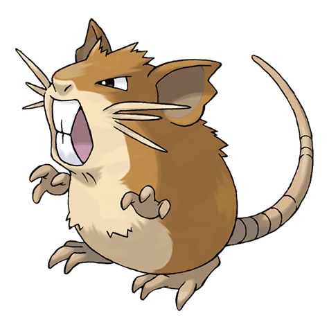

# Raticate (Alolan Form) (#0020A)

*Mouse Pokemon*

**Type:** Buio / Normale
**Abilities:** [[Gluttony]], [[Hustle]], [[Thick Fat]] *(Hidden)*
**Base HP:** 4

> Alolan Raticate command their Rattata underlings to bring them food every night. Five star restaurants often struggle with these aggressive Pokemon nesting close to their grounds.

---

## Statistiche (Attributes & Limits)

| Attribute | Base / Limit |
|---|---|
| **Strength** | 2/5 |
| **Dexterity** | 2/5 |
| **Vitality** | 2/5 |
| **Special** | 1/3 |
| **Insight** | 2/5 |

---

## Mosse (Learnset)

- **Starter:** [[Tail_Whip|Tail Whip]], [[Tackle|Tackle]]
- **Beginner:** [[Focus_Energy|Focus Energy]], [[Quick_Attack|Quick Attack]], [[Bite|Bite]]
- **Amateur:** [[Pursuit|Pursuit]], [[Scary_Face|Scary Face]], [[Sucker_Punch|Sucker Punch]], [[Hyper_Fang|Hyper Fang]], [[Assurance|Assurance]]
- **Ace:** [[Crunch|Crunch]], [[Double_Edge|Double-Edge]], [[Super_Fang|Super Fang]], [[Swords_Dance|Swords Dance]], [[Endeavor|Endeavor]]
- **Pro:** [[Stockpile|Stockpile]], [[Swallow|Swallow]], [[Me_First|Me First]]

---
