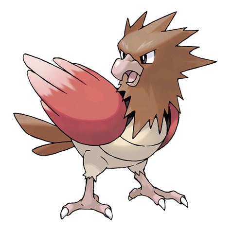

---
title: "Spearow (#0021)"
category: Pokedex
tags: [spearow, kanto, normal, flying]
image: "assets/images/pokemon/021.png"
---

# Spearow (#0021)

*Tiny Bird Pokemon*

**Type:** Normal / Flying
**Abilities:** [[Keen Eye]], [[Sniper]] *(Hidden)*
**Base HP:** 3

> Lives in flocks on grasslands. Very protective of its territory. It flaps its short wings to dart around at high speed. It is a little short-tempered - if disturbed, it will shriek, calling its flock for aid.

---

## Statistiche (Attributes & Limits)

| Attribute | Base / Limit |
|---|---|
| **Strength** | 2/4 |
| **Dexterity** | 2/5 |
| **Vitality** | 1/3 |
| **Special** | 1/3 |
| **Insight** | 1/3 |

---

## Mosse (Learnset)

- **Starter:** [[Peck]], [[Growl]]
- **Beginner:** [[Leer]], [[Fury_Attack]]
- **Amateur:** [[Pursuit]], [[Aerial_Ace]], [[Assurance]], [[Focus_Energy]], [[Mirror_Move]], [[Agility]]
- **Ace:** [[Roost]], [[Drill_Peck]]
- **Pro:** [[Tailwind]], [[Scary_Face]], [[Feather_Dance]]

---

## Correlati

### Catena Evolutiva
- [[0022_Fearow|Fearow]]
