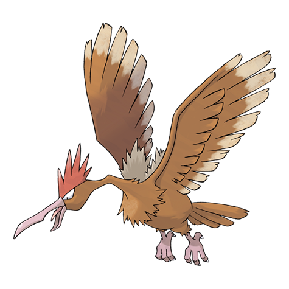

---
title: "Fearow (#0022)"
category: Pokedex
tags: [fearow, kanto, normal, flying]
image: "assets/images/pokemon/022.png"
---

# Fearow (#0022)

*Beak Pokemon*

**Type:** Normal / Flying
**Abilities:** [[Keen Eye]], [[Sniper]] *(Hidden)*
**Base HP:** 4

> Fearrows soar around wastelands and fields. It has the stamina to fly all day. It is easily annoyed and ill tempered. It attacks using its sharp beak to peck and pierce the foes.

---

## Statistiche (Attributes & Limits)

| Attribute | Base / Limit |
|---|---|
| **Strength** | 2/5 |
| **Dexterity** | 3/6 |
| **Vitality** | 2/4 |
| **Special** | 2/4 |
| **Insight** | 2/4 |

---

## Mosse (Learnset)

- **Starter:** [[Peck]], [[Growl]]
- **Beginner:** [[Leer]], [[Fury_Attack]]
- **Amateur:** [[Pursuit]], [[Aerial_Ace]], [[Assurance]], [[Focus_Energy]], [[Mirror_Move]], [[Agility]]
- **Ace:** [[Roost]], [[Drill_Peck]], [[Drill_Run]], [[Pluck]]
- **Pro:** [[Sky_Attack]], [[Scary_Face]], [[Curse]]

---

## Correlati

### Catena Evolutiva
- [[0021_Spearow|Spearow]]
