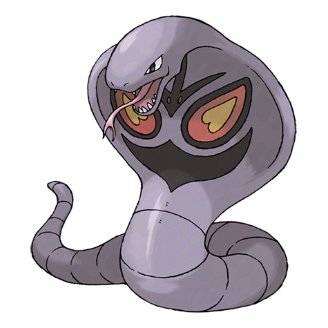

---
title: "Arbok (#0024)"
category: Pokedex
tags: [arbok, kanto, poison]
image: "assets/images/pokemon/024.png"
---

# Arbok (#0024)

*Cobra Pokemon*

**Type:** Poison
**Abilities:** [[Intimidate]], [[Shed Skin]], [[Unnerve]] *(Hidden)*
**Base HP:** 5

> This Pokemon has an incredibly strong constricting power. Once it wraps its body around its foe, escaping is almost impossible. The pattern on its body glows in the dark like a terrifying face.

---

## Statistiche (Attributes & Limits)

| Attribute | Base / Limit |
|---|---|
| **Strength** | 3/6 |
| **Dexterity** | 2/5 |
| **Vitality** | 2/5 |
| **Special** | 2/4 |
| **Insight** | 2/5 |

---

## Mosse (Learnset)

- **Starter:** [[Leer]], [[Wrap]]
- **Beginner:** [[Bite]], [[Poison_Sting]], [[Glare]]
- **Amateur:** [[Screech]], [[Acid]], [[Ice_Fang]], [[Thunder_Fang]], [[Fire_Fang]], [[Crunch]], [[Stockpile]], [[Spit_Up]], [[Swallow]], [[Acid_Spray]], [[Mud_Bomb]]
- **Ace:** [[Gastro_Acid]], [[Belch]], [[Haze]], [[Coil]], [[Gunk_Shot]], [[Spite]]
- **Pro:** [[Aqua_Tail]], [[Iron_Tail]]

---

## Correlati

### Catena Evolutiva
- [[0023_Ekans|Ekans]]
