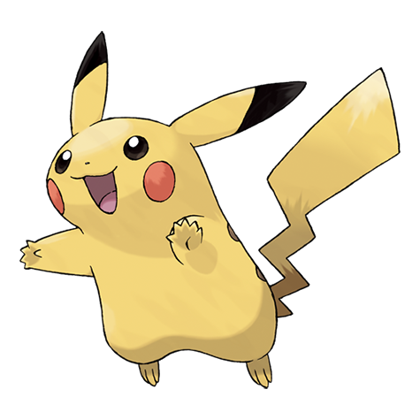
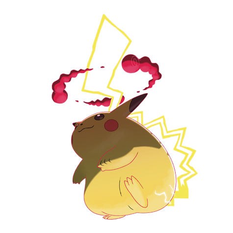

---
title: "Pikachu (#0025)"
category: Pokedex
tags: [pikachu, kanto, electric]
image: "assets/images/pokemon/025.png"
---

# Pikachu (#0025)

*Mouse Pokemon*

**Type:** Electric
**Abilities:** [[Static]], [[Lightning Rod]] *(Hidden)*
**Base HP:** 4

> Lives in small groups in forests but they tend to stay hidden. It stores electricity in the electric sacs on its cheeks and uses its tail to ground the excess charge. They can be stubborn and wary of strangers.

---

## Statistiche (Attributes & Limits)

| Attribute | Base / Limit |
|---|---|
| **Strength** | 2/4 |
| **Dexterity** | 2/5 |
| **Vitality** | 1/3 |
| **Special** | 2/4 |
| **Insight** | 2/4 |

---

## Mosse (Learnset)

- **Starter:** [[Thunder_Shock]], [[Tail_Whip]]
- **Beginner:** [[Growl]], [[Play_Nice]], [[Quick_Attack]], [[Thunder_Wave]]
- **Amateur:** [[Electro_Ball]], [[Double_Team]], [[Nuzzle]], [[Slam]], [[Spark]], [[Thunderbolt]], [[Feint]], [[Agility]]
- **Ace:** [[Discharge]], [[Light_Screen]], [[Thunder]], [[Wild_Charge]]
- **Pro:** [[Surf]], [[Volt_Tackle]], [[Extreme_Speed]]

---

## Forme Speciali

### Pikachu (Gigantamax)

*Forma Gigantamax — richiede Dynamax Band e Pokémon Stadium, oppure Power Spot naturale.*

Vedi [[Max_Moves]] per le G-Max Moves disponibili e i relativi effetti.

 

---

## Correlati

### Catena Evolutiva
- [[0026_Raichu|Raichu]]
