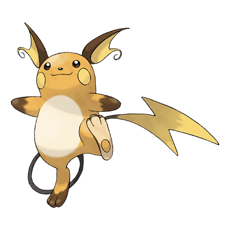

---
title: "Raichu (#0026)"
category: Pokedex
tags: [raichu, kanto, electric]
image: "assets/images/pokemon/026.png"
---

# Raichu (#0026)

*Mouse Pokemon*

**Type:** Electric
**Abilities:** [[Static]], [[Lightning Rod]] *(Hidden)*
**Base HP:** 5

> When electricity builds on its body, it starts to emit a faint glow and it becomes more aggressive than it normally is. They live in forests but are rare to find in the wild.

---

## Statistiche (Attributes & Limits)

| Attribute | Base / Limit |
|---|---|
| **Strength** | 2/5 |
| **Dexterity** | 3/6 |
| **Vitality** | 2/4 |
| **Special** | 3/6 |
| **Insight** | 2/5 |

---

## Mosse (Learnset)

- **Starter:** [[Thunder_Shock]], [[Tail_Whip]]
- **Beginner:** [[Quick_Attack]]
- **Amateur:** [[Thunderbolt]]
- **Ace:** [[Fake_Out]]
- **Pro:** [[Wish]], [[Volt_Tackle]]

---

## Correlati

### Catena Evolutiva
- [[0025_Pikachu|Pikachu]]
