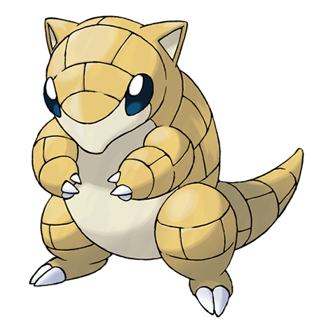

---
title: "Sandshrew (#0027)"
category: Pokedex
tags: [sandshrew, kanto, ground]
image: "assets/images/pokemon/027.png"
---

# Sandshrew (#0027)

*Mouse Pokemon*

**Type:** Ground
**Abilities:** [[Sand Veil]], [[Sand Rush]] *(Hidden)*
**Base HP:** 3

> They usually hide burrowed under caves and grasslands. A few have been sighted living in the desert. They are shy by nature - they dig and curl in a ball when facing a threat.

---

## Statistiche (Attributes & Limits)

| Attribute | Base / Limit |
|---|---|
| **Strength** | 2/5 |
| **Dexterity** | 1/3 |
| **Vitality** | 2/5 |
| **Special** | 1/3 |
| **Insight** | 1/3 |

---

## Mosse (Learnset)

- **Starter:** [[Scratch]], [[Defense_Curl]]
- **Beginner:** [[Sand_Attack]], [[Poison_Sting]], [[Rollout]]
- **Amateur:** [[Rapid_Spin]], [[Swift]], [[Fury_Cutter]], [[Magnitude]], [[Fury_Swipes]], [[Sand_Tomb]], [[Dig]]
- **Ace:** [[Slash]], [[Gyro_Ball]], [[Swords_Dance]], [[Sandstorm]], [[Earthquake]]
- **Pro:** [[Stealth_Rock]], [[Bulldoze]], [[Metal_Claw]]

---

## Correlati

### Catena Evolutiva
- [[0028_Sandslash|Sandslash]]
