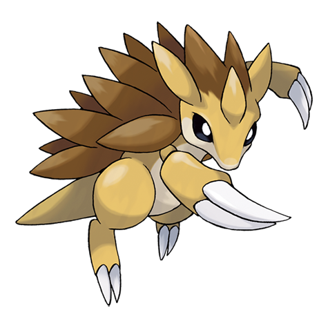

# Sandslash (Alolan Form) (#0028A)

*Mouse Pokemon*

**Type:** Ghiaccio / Acciaio
**Abilities:** [[Snow Cloak]], [[Slush Rush]] *(Hidden)*
**Base HP:** 4

> These Pokemon make their burrows on Alola's ice caverns, hidden in plain sight. Careful with its spikes, any puncture into the skin and you can get severe frostbite. They can’t stand high temperatures.

---

## Statistiche (Attributes & Limits)

| Attribute | Base / Limit |
|---|---|
| **Strength** | 3/6 |
| **Dexterity** | 2/4 |
| **Vitality** | 3/7 |
| **Special** | 1/3 |
| **Insight** | 2/4 |

---

## Mosse (Learnset)

- **Starter:** [[Icicle_Spear|Icicle Spear]]
- **Beginner:** [[Metal_Burst|Metal Burst]]
- **Amateur:** [[Icicle_Crash|Icicle Crash]], [[Slash|Slash]], [[Defense_Curl|Defense Curl]], [[Ice_Ball|Ice Ball]]
- **Ace:** [[Metal_Claw|Metal Claw]], [[Chip_Away|Chip Away]]
- **Pro:** [[Counter|Counter]], [[Aurora_Veil|Aurora Veil]]

---
