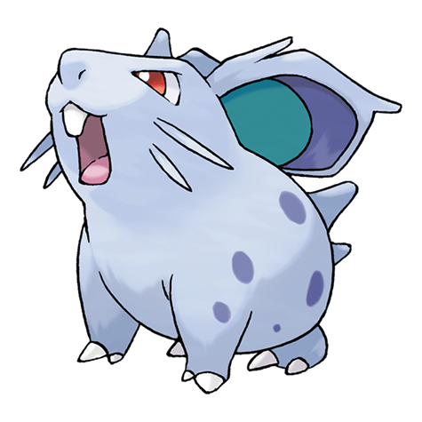

---
title: "Nidoran F (#0029)"
category: Pokedex
tags: [nidoranf, kanto, poison]
image: "assets/images/pokemon/029.png"
---

# Nidoran F (#0029)

*Poison Pin Pokemon*

**Type:** Poison
**Abilities:** [[Poison Point]], [[Rivalry]], [[Hustle]] *(Hidden)*
**Base HP:** 3

> A female only species. It lives close to meadows and forests. They are mellow Pokemon. To protect herself, she secretes a powerful toxin through her body. Her horn is small but venomous to the touch.

---

## Statistiche (Attributes & Limits)

| Attribute | Base / Limit |
|---|---|
| **Strength** | 2/4 |
| **Dexterity** | 1/3 |
| **Vitality** | 2/4 |
| **Special** | 1/3 |
| **Insight** | 1/3 |

---

## Mosse (Learnset)

- **Starter:** [[Scratch]], [[Growl]]
- **Beginner:** [[Tail_Whip]], [[Double_Kick]], [[Poison_Sting]]
- **Amateur:** [[Fury_Swipes]], [[Bite]], [[Helping_Hand]], [[Toxic_Spikes]], [[Poison_Fang]]
- **Ace:** [[Flatter]], [[Captivate]], [[Crunch]]
- **Pro:** [[Lovely_Kiss]], [[Moonlight]], [[Charm]]

---

## Correlati

### Catena Evolutiva
- [[0030_Nidorina|Nidorina]]
- [[0031_Nidoqueen|Nidoqueen]]
