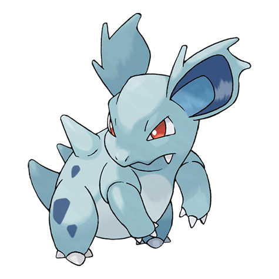

---
title: "Nidorina (#0030)"
category: Pokedex
tags: [nidorina, kanto, poison]
image: "assets/images/pokemon/030.png"
---

# Nidorina (#0030)

*Poison Pin Pokemon*

**Type:** Poison
**Abilities:** [[Poison Point]], [[Rivalry]], [[Hustle]] *(Hidden)*
**Base HP:** 4

> Nidorinas are jealous creatures. They don’t like other females near their mates. Otherwise, they are very social creatures. When it’s around friends or family, its barbs are tucked away to prevent injury.

---

## Statistiche (Attributes & Limits)

| Attribute | Base / Limit |
|---|---|
| **Strength** | 2/4 |
| **Dexterity** | 2/4 |
| **Vitality** | 2/4 |
| **Special** | 2/4 |
| **Insight** | 2/4 |

---

## Mosse (Learnset)

- **Starter:** [[Scratch]], [[Growl]]
- **Beginner:** [[Tail_Whip]], [[Double_Kick]], [[Poison_Sting]]
- **Amateur:** [[Fury_Swipes]], [[Bite]], [[Helping_Hand]], [[Toxic_Spikes]], [[Poison_Fang]]
- **Ace:** [[Flatter]], [[Captivate]], [[Crunch]]
- **Pro:** [[Lovely_Kiss]], [[Moonlight]], [[Charm]]

---

## Correlati

### Catena Evolutiva
- [[0029_Nidoran_F|Nidoran F]]
- [[0031_Nidoqueen|Nidoqueen]]
