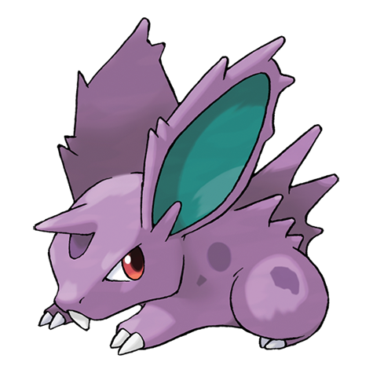

---
title: "Nidoran M (#0032)"
category: Pokedex
tags: [nidoranm, kanto, poison]
image: "assets/images/pokemon/032.png"
---

# Nidoran M (#0032)

*Poison Pin Pokemon*

**Type:** Poison
**Abilities:** [[Poison Point]], [[Rivalry]], [[Hustle]] *(Hidden)*
**Base HP:** 3

> The male Nidoran has developed a great alertness to sounds. Its small body is covered in spikes that are drenched in venom when he’s threatened. He will defend his mate and home fiercely.

---

## Statistiche (Attributes & Limits)

| Attribute | Base / Limit |
|---|---|
| **Strength** | 2/4 |
| **Dexterity** | 2/4 |
| **Vitality** | 1/3 |
| **Special** | 1/3 |
| **Insight** | 1/3 |

---

## Mosse (Learnset)

- **Starter:** [[Peck]], [[Leer]]
- **Beginner:** [[Focus_Energy]], [[Double_Kick]], [[Poison_Sting]]
- **Amateur:** [[Fury_Attack]], [[Horn_Attack]], [[Helping_Hand]], [[Toxic_Spikes]], [[Poison_Jab]]
- **Ace:** [[Flatter]], [[Captivate]], [[Horn_Drill]]
- **Pro:** [[Lovely_Kiss]], [[Morning_Sun]], [[Confusion]]

---

## Correlati

### Catena Evolutiva
- [[0033_Nidorino|Nidorino]]
- [[0034_Nidoking|Nidoking]]
