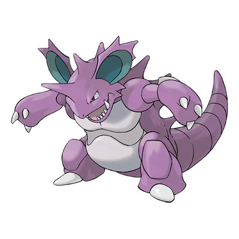

---
title: "Nidoking (#0034)"
category: Pokedex
tags: [nidoking, kanto, poison, ground]
image: "assets/images/pokemon/034.png"
---

# Nidoking (#0034)

*Drill Pokemon*

**Type:** Poison / Ground
**Abilities:** [[Poison Point]], [[Rivalry]], [[Sheer Force]] *(Hidden)*
**Base HP:** 5

> It is recognized by its rock-hard hide and its extended horn. Be careful with the horn as it contains venom. There are records of one trampling and destroying a radio tower that was being built on his territory.

---

## Statistiche (Attributes & Limits)

| Attribute | Base / Limit |
|---|---|
| **Strength** | 3/6 |
| **Dexterity** | 2/5 |
| **Vitality** | 2/5 |
| **Special** | 2/5 |
| **Insight** | 2/5 |

---

## Mosse (Learnset)

- **Starter:** [[Peck]]
- **Beginner:** [[Poison_Sting]], [[Focus_Energy]], [[Double_Kick]]
- **Amateur:** [[Chip_Away]], [[Earth_Power]]
- **Ace:** [[Drill_Run]], [[Megahorn]]
- **Pro:** [[Poison_Tail]], [[Thrash]], [[Head_Smash]]

---

## Correlati

### Catena Evolutiva
- [[0032_Nidoran_M|Nidoran M]]
- [[0033_Nidorino|Nidorino]]
