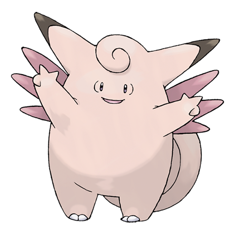

---
title: "Clefable (#0036)"
category: Pokedex
tags: [clefable, kanto, fairy]
image: "assets/images/pokemon/036.png"
---

# Clefable (#0036)

*Fairy Pokemon*

**Type:** Fairy
**Abilities:** [[Cute Charm]], [[Magic Guard]], [[Unaware]] *(Hidden)*
**Base HP:** 5

> There are not many records about it in the wild. They are timid but playful. Clefable uses its wings to skip lightly as if it was flying. Its bouncy step lets it walk on water. On quiet, moonlit nights, it strolls near lakes.

---

## Statistiche (Attributes & Limits)

| Attribute | Base / Limit |
|---|---|
| **Strength** | 2/5 |
| **Dexterity** | 2/4 |
| **Vitality** | 2/5 |
| **Special** | 3/6 |
| **Insight** | 2/5 |

---

## Mosse (Learnset)

- **Beginner:** [[Spotlight]], [[Sing]]
- **Amateur:** [[Moonblast]], [[Minimize]], [[Double_Slap]]
- **Ace:** [[Drain_Punch]], [[Metronome]]
- **Pro:** [[Heal_Pulse]], [[Wish]]

---

## Correlati

### Catena Evolutiva
- [[0035_Clefairy|Clefairy]]
