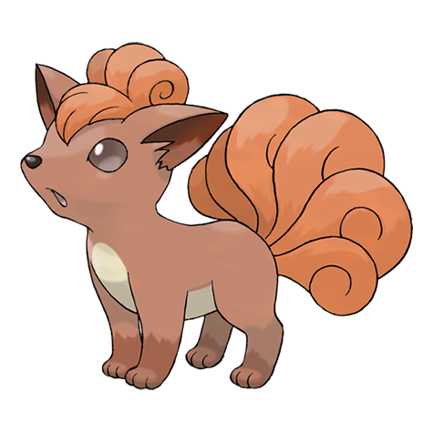

---
title: "Vulpix (#0037)"
category: Pokedex
tags: [vulpix, kanto, fire]
image: "assets/images/pokemon/037.png"
---

# Vulpix (#0037)

*Fox Pokemon*

**Type:** Fire
**Abilities:** [[Flash Fire]], [[Drought]] *(Hidden)*
**Base HP:** 3

> It is born with just one tail. As it grows, its single white tail gains color and splits into six. It is quite warm and cuddly - very popular with the ladies . It is, however, uncommon to see one in the wild.

---

## Statistiche (Attributes & Limits)

| Attribute | Base / Limit |
|---|---|
| **Strength** | 1/3 |
| **Dexterity** | 2/4 |
| **Vitality** | 1/3 |
| **Special** | 2/4 |
| **Insight** | 2/4 |

---

## Mosse (Learnset)

- **Starter:** [[Ember]], [[Tail_Whip]]
- **Beginner:** [[Roar]], [[Baby-Doll_Eyes]], [[Quick_Attack]]
- **Amateur:** [[Fire_Spin]], [[Confuse_Ray]], [[Imprison]], [[Feint_Attack]], [[Flame_Burst]], [[Will-O-Wisp]], [[Hex]], [[Payback]], [[Extrasensory]]
- **Ace:** [[Safeguard]], [[Flamethrower]], [[Captivate]], [[Grudge]], [[Fire_Blast]], [[Inferno]]
- **Pro:** [[Pain_Split]], [[Spite]], [[Heat_Wave]]

---

## Correlati

### Catena Evolutiva
- [[0038_Ninetales|Ninetales]]

---

## Vulpix (Forma Alola) (#0037A)

**Type:** Ghiaccio
**Abilities:** [[Snow Cloak]], [[Snow Warning]] *(Hidden)*
**Base HP:** 3

| Attribute | Base / Limit |
|---|---|
| **Strength** | 1/3 |
| **Dexterity** | 2/4 |
| **Vitality** | 1/3 |
| **Special** | 2/4 |
| **Insight** | 2/4 |

### Mosse

- **Starter:** [[Powder_Snow|Powder Snow]], [[Tail_Whip|Tail Whip]]
- **Beginner:** [[Roar|Roar]], [[Baby_Doll_Eyes|Baby-Doll Eyes]], [[Ice_Shard|Ice Shard]]
- **Amateur:** [[Confuse_Ray|Confuse Ray]], [[Icy_Wind|Icy Wind]], [[Payback|Payback]], [[Mist|Mist]], [[Feint_Attack|Feint Attack]], [[Imprison|Imprison]], [[Aurora_Beam|Aurora Beam]], [[Extrasensory|Extrasensory]], [[Hex|Hex]]
- **Ace:** [[Ice_Beam|Ice Beam]], [[Safeguard|Safeguard]], [[Captivate|Captivate]], [[Grudge|Grudge]], [[Blizzard|Blizzard]], [[Sheer_Cold|Sheer Cold]]
- **Pro:** [[Moonblast|Moonblast]], [[Spite|Spite]], [[Freeze_Dry|Freeze Dry]]
