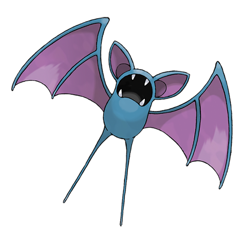

---
title: "Zubat (#0041)"
category: Pokedex
tags: [zubat, kanto, poison, flying]
image: "assets/images/pokemon/041.png"
---

# Zubat (#0041)

*Bat Pokemon*

**Type:** Poison / Flying
**Abilities:** [[Inner Focus]], [[Infiltrator]] *(Hidden)*
**Base HP:** 3

> It lives in dark caves all around the world. Prolonged exposure to the sun will make it unhealthy. It is blind but uses echolocation to find its way. At night, they leave their cave to feed on fruit and bug Pokemon.

---

## Statistiche (Attributes & Limits)

| Attribute | Base / Limit |
|---|---|
| **Strength** | 2/4 |
| **Dexterity** | 2/4 |
| **Vitality** | 1/3 |
| **Special** | 1/3 |
| **Insight** | 1/3 |

---

## Mosse (Learnset)

- **Starter:** [[Absorb]]
- **Beginner:** [[Supersonic]], [[Astonish]]
- **Amateur:** [[Bite]], [[Wing_Attack]], [[Confuse_Ray]], [[Air_Cutter]], [[Swift]], [[Poison_Fang]], [[Mean_Look]], [[Leech_Life]]
- **Ace:** [[Acrobatics]], [[Haze]], [[Venoshock]], [[Air_Slash]], [[Quick_Guard]]
- **Pro:** [[Nasty_Plot]], [[Super_Fang]], [[Venom_Drench]]

---

## Correlati

### Catena Evolutiva
- [[0042_Golbat|Golbat]]
