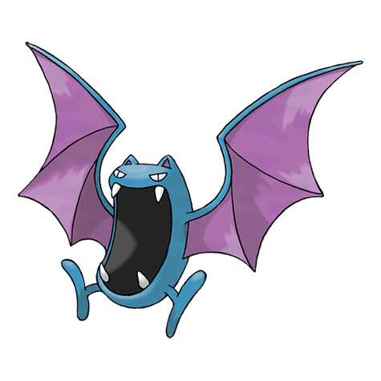

---
title: "Golbat (#0042)"
category: Pokedex
tags: [golbat, kanto, poison, flying]
image: "assets/images/pokemon/042.png"
---

# Golbat (#0042)

*Bat Pokemon*

**Type:** Poison / Flying
**Abilities:** [[Inner Focus]], [[Infiltrator]] *(Hidden)*
**Base HP:** 4

> A stealthy Pokemon who loves the dark. Its fangs can puncture even a thick hide. It loves to feast on the blood of people and Pokemon alike. If it drinks too much, it gets heavy and can hardly fly.

---

## Statistiche (Attributes & Limits)

| Attribute | Base / Limit |
|---|---|
| **Strength** | 2/5 |
| **Dexterity** | 2/5 |
| **Vitality** | 2/5 |
| **Special** | 2/4 |
| **Insight** | 2/5 |

---

## Mosse (Learnset)

- **Starter:** [[Absorb]]
- **Beginner:** [[Wing_Attack]], [[Supersonic]], [[Astonish]]
- **Amateur:** [[Bite]], [[Screech]], [[Confuse_Ray]], [[Air_Cutter]], [[Swift]], [[Poison_Fang]], [[Mean_Look]], [[Leech_Life]]
- **Ace:** [[Acrobatics]], [[Haze]], [[Venoshock]], [[Air_Slash]], [[Quick_Guard]]
- **Pro:** [[Nasty_Plot]], [[Super_Fang]], [[Venom_Drench]]

---

## Correlati

### Catena Evolutiva
- [[0041_Zubat|Zubat]]
