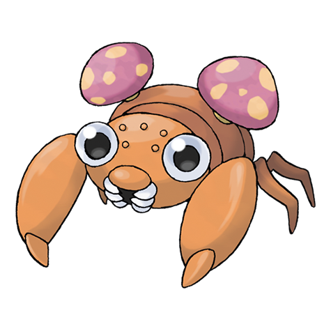

---
title: "Paras (#0046)"
category: Pokedex
tags: [paras, kanto, bug, grass]
image: "assets/images/pokemon/046.png"
---

# Paras (#0046)

*Mushroom Pokemon*

**Type:** Bug / Grass
**Abilities:** [[Effect Spore]], [[Dry Skin]], [[Damp]] *(Hidden)*
**Base HP:** 3

> Paras has two parasitic mushrooms growing on its back. They grow large by drawing nutrients from this Bug Pokemon. They are valued as a medicine for prolonging life. Paras can be found in humid areas.

---

## Statistiche (Attributes & Limits)

| Attribute | Base / Limit |
|---|---|
| **Strength** | 2/5 |
| **Dexterity** | 1/3 |
| **Vitality** | 2/4 |
| **Special** | 2/4 |
| **Insight** | 2/4 |

---

## Mosse (Learnset)

- **Starter:** [[Scratch]], [[Stun_Spore]]
- **Beginner:** [[Poison_Powder]], [[Absorb]]
- **Amateur:** [[Fury_Cutter]], [[Spore]], [[Slash]], [[Growth]], [[Giga_Drain]]
- **Ace:** [[Aromatherapy]], [[Rage_Powder]], [[X-Scissor]]
- **Pro:** [[Wide_Guard]], [[Rototiller]], [[Leech_Seed]]

---

## Correlati

### Catena Evolutiva
- [[0047_Parasect|Parasect]]
