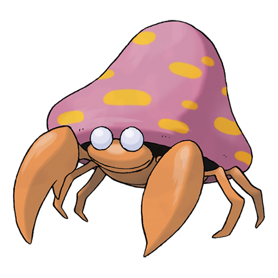

---
title: "Parasect (#0047)"
category: Pokedex
tags: [parasect, kanto, bug, grass]
image: "assets/images/pokemon/047.png"
---

# Parasect (#0047)

*Mushroom Pokemon*

**Type:** Bug / Grass
**Abilities:** [[Effect Spore]], [[Dry Skin]], [[Damp]] *(Hidden)*
**Base HP:** 4

> Their personality changes after evolution since the mushroom takes over its mind. Its body is now a husk devoid of nutrients. To survive they cling to a tree and absorb the nutrients until the tree dies.

---

## Statistiche (Attributes & Limits)

| Attribute | Base / Limit |
|---|---|
| **Strength** | 3/6 |
| **Dexterity** | 1/3 |
| **Vitality** | 2/5 |
| **Special** | 2/5 |
| **Insight** | 2/5 |

---

## Mosse (Learnset)

- **Starter:** [[Scratch]], [[Stun_Spore]]
- **Beginner:** [[Absorb]], [[Poison_Powder]]
- **Amateur:** [[Cross_Poison]], [[Fury_Cutter]], [[Spore]], [[Slash]], [[Growth]], [[Giga_Drain]]
- **Ace:** [[Aromatherapy]], [[Rage_Powder]], [[X-Scissor]]
- **Pro:** [[Psybeam]], [[Synthesis]], [[Seed_Bomb]]

---

## Correlati

### Catena Evolutiva
- [[0046_Paras|Paras]]
