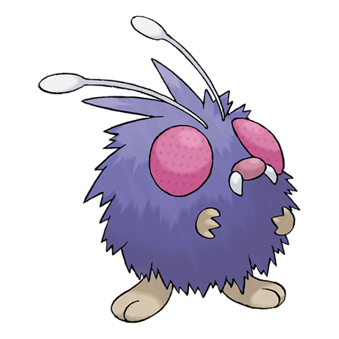

---
title: "Venonat (#0048)"
category: Pokedex
tags: [venonat, kanto, bug, poison]
image: "assets/images/pokemon/048.png"
---

# Venonat (#0048)

*Insect Pokemon*

**Type:** Bug / Poison
**Abilities:** [[Compound Eyes]], [[Tinted Lens]], [[Run_Away]] *(Hidden)*
**Base HP:** 3

> It lives in the holes of trees in dense forests and jungles. Its large eyes never fail to spot even minuscule prey. Sometimes Venonat uses its powers to confuse travelers and make them lose their way.

---

## Statistiche (Attributes & Limits)

| Attribute | Base / Limit |
|---|---|
| **Strength** | 2/4 |
| **Dexterity** | 1/3 |
| **Vitality** | 2/4 |
| **Special** | 2/4 |
| **Insight** | 2/4 |

---

## Mosse (Learnset)

- **Starter:** [[Tackle]], [[Foresight]]
- **Beginner:** [[Disable]], [[Supersonic]]
- **Amateur:** [[Confusion]], [[Poison_Powder]], [[Leech_Life]], [[Stun_Spore]], [[Psybeam]], [[Poison_Fang]]
- **Ace:** [[Signal_Beam]], [[Zen_Headbutt]], [[Sleep_Powder]], [[Psychic]]
- **Pro:** [[Agility]], [[Baton_Pass]], [[Giga_Drain]]

---

## Correlati

### Catena Evolutiva
- [[0049_Venomoth|Venomoth]]
