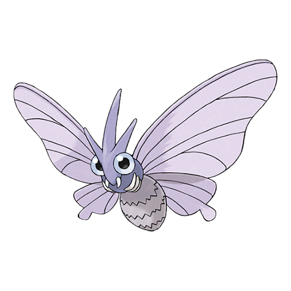

---
title: "Venomoth (#0049)"
category: Pokedex
tags: [venomoth, kanto, bug, poison]
image: "assets/images/pokemon/049.png"
---

# Venomoth (#0049)

*Poison Moth Pokemon*

**Type:** Bug / Poison
**Abilities:** [[Shield Dust]], [[Tinted Lens]], [[Wonder Skin]] *(Hidden)*
**Base HP:** 4

> They are plentiful in forests but only come out at night. They possess an incredible eyesight and are attracted to light sources. Their wings scatter a toxic powder which they use to immobilize their prey.

---

## Statistiche (Attributes & Limits)

| Attribute | Base / Limit |
|---|---|
| **Strength** | 2/4 |
| **Dexterity** | 2/4 |
| **Vitality** | 2/5 |
| **Special** | 2/5 |
| **Insight** | 2/5 |

---

## Mosse (Learnset)

- **Starter:** [[Foresight]]
- **Beginner:** [[Disable]], [[Confusion]], [[Supersonic]]
- **Amateur:** [[Silver_Wind]], [[Quiver_Dance]], [[Poison_Fang]], [[Poison_Powder]], [[Leech_Life]], [[Stun_Spore]], [[Psybeam]]
- **Ace:** [[Sleep_Powder]], [[Signal_Beam]], [[Zen_Headbutt]], [[Bug_Buzz]], [[Psychic]]
- **Pro:** [[Giga_Drain]], [[Morning_Sun]], [[Defog]]

---

## Correlati

### Catena Evolutiva
- [[0048_Venonat|Venonat]]
