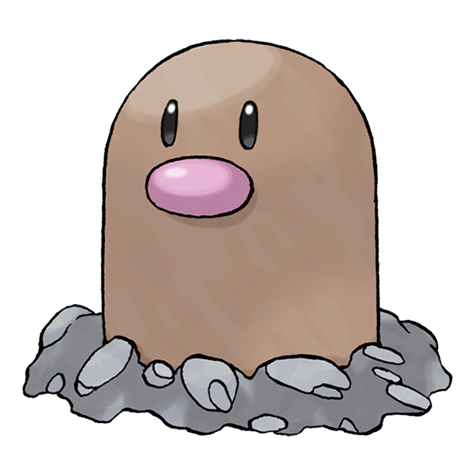

# Diglett (Alolan Form) (#0050A)

*Mole Pokemon*

**Type:** Terra / Acciaio
**Abilities:** [[Sand Veil]], [[Tangling Hair]], [[Sand Force]] *(Hidden)*
**Base HP:** 3

> This variant of Diglett is only found in the Alola region. The small hairs on its head are used perceive its surroundings while burrowed, do not cut them or Diglett will become very sick.

---

## Statistiche (Attributes & Limits)

| Attribute | Base / Limit |
|---|---|
| **Strength** | 2/4 |
| **Dexterity** | 2/5 |
| **Vitality** | 1/3 |
| **Special** | 1/3 |
| **Insight** | 1/4 |

---

## Mosse (Learnset)

- **Starter:** [[Sand_Attack|Sand Attack]], [[Metal_Claw|Metal Claw]]
- **Beginner:** [[Growl|Growl]], [[Astonish|Astonish]], [[Mud_Slap|Mud Slap]]
- **Amateur:** [[Magnitude|Magnitude]], [[Bulldoze|Bulldoze]], [[Sucker_Punch|Sucker Punch]], [[Mud_Bomb|Mud Bomb]], [[Earth_Power|Earth Power]], [[Dig|Dig]]
- **Ace:** [[Iron_Head|Iron Head]], [[Earthquake|Earthquake]], [[Fissure|Fissure]]
- **Pro:** [[Feint_Attack|Feint Attack]], [[Metal_Sound|Metal Sound]], [[Thrash|Thrash]]

---
