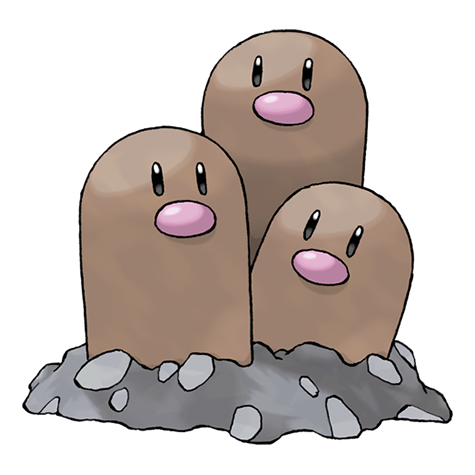

---
title: "Dugtrio (#0051)"
category: Pokedex
tags: [dugtrio, kanto, ground]
image: "assets/images/pokemon/051.png"
---

# Dugtrio (#0051)

*Mole Pokemon*

**Type:** Ground
**Abilities:** [[Sand Veil]], [[Arena Trap]], [[Sand Force]] *(Hidden)*
**Base HP:** 4

> Because the triplets originally split from one body, they think exactly alike. They work together to dig endlessly through the ground. They are known for destroying the foundations of roads and buildings.

---

## Statistiche (Attributes & Limits)

| Attribute | Base / Limit |
|---|---|
| **Strength** | 2/5 |
| **Dexterity** | 3/7 |
| **Vitality** | 2/4 |
| **Special** | 2/4 |
| **Insight** | 2/5 |

---

## Mosse (Learnset)

- **Starter:** [[Scratch]], [[Sand_Attack]]
- **Beginner:** [[Growl]], [[Astonish]], [[Mud_Slap]]
- **Amateur:** [[Magnitude]], [[Bulldoze]], [[Earth_Power]], [[Mud_Bomb]], [[Rototiller]], [[Dig]], [[Tri_Attack]]
- **Ace:** [[Sand_Tomb]], [[Night_Slash]], [[Sucker_Punch]], [[Slash]], [[Earthquake]], [[Fissure]]
- **Pro:** [[Rock_Slide]], [[Ancient_Power]], [[Stealth_Rock]]

---

## Correlati

### Catena Evolutiva
- [[0050_Diglett|Diglett]]

---

## Dugtrio (Forma Alola) (#0051A)

**Type:** Terra / Acciaio
**Abilities:** [[Sand Veil]], [[Tangling Hair]], [[Sand Force]] *(Hidden)*
**Base HP:** 4

| Attribute | Base / Limit |
|---|---|
| **Strength** | 3/6 |
| **Dexterity** | 3/6 |
| **Vitality** | 2/4 |
| **Special** | 2/4 |
| **Insight** | 2/5 |

### Mosse

- **Starter:** [[Sand_Attack|Sand Attack]], [[Metal_Claw|Metal Claw]]
- **Beginner:** [[Growl|Growl]], [[Astonish|Astonish]], [[Mud_Slap|Mud Slap]]
- **Amateur:** [[Rototiller|Rototiller]], [[Dig|Dig]], [[Tri_Attack|Tri Attack]], [[Sand_Tomb|Sand Tomb]], [[Magnitude|Magnitude]], [[Bulldoze|Bulldoze]], [[Earth_Power|Earth Power]], [[Mud_Bomb|Mud Bomb]]
- **Ace:** [[Night_Slash|Night Slash]], [[Sucker_Punch|Sucker Punch]], [[Iron_Head|Iron Head]], [[Earthquake|Earthquake]], [[Fissure|Fissure]]
- **Pro:** [[Ancient_Power|Ancient Power]], [[Thrash|Thrash]], [[Stone_Edge|Stone Edge]]
