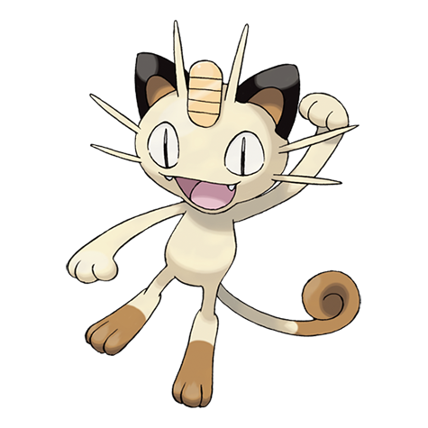
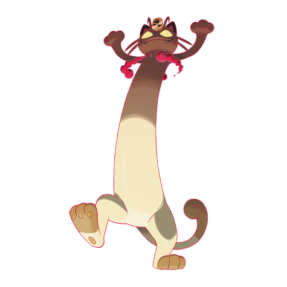

---
title: "Meowth (#0052)"
category: Pokedex
tags: [meowth, kanto, normal]
image: "assets/images/pokemon/052.png"
---

# Meowth (#0052)

*Scratch Cat Pokemon*

**Type:** Normal
**Abilities:** [[Pickup]], [[Technician]], [[Unnerve]] *(Hidden)*
**Base HP:** 3

> They used to live in grasslands but have adapted really well to life in the city. Shiny things fascinate them and they keep a little treasure hidden. The coin on its head is its most prized possession.

---

## Statistiche (Attributes & Limits)

| Attribute | Base / Limit |
|---|---|
| **Strength** | 2/4 |
| **Dexterity** | 2/5 |
| **Vitality** | 1/3 |
| **Special** | 1/3 |
| **Insight** | 1/3 |

---

## Mosse (Learnset)

- **Starter:** [[Scratch]], [[Growl]]
- **Beginner:** [[Bite]], [[Fake_Out]], [[Fury_Swipes]]
- **Amateur:** [[Screech]], [[Feint_Attack]], [[Taunt]], [[Pay_Day]], [[Slash]], [[Captivate]]
- **Ace:** [[Assurance]], [[Nasty_Plot]], [[Night_Slash]], [[Feint]]
- **Pro:** [[Charm]], [[Sing]], [[Snatch]]

---

## Forme Speciali

### Meowth (Gigantamax)

*Forma Gigantamax — richiede Dynamax Band e Pokémon Stadium, oppure Power Spot naturale.*

Vedi [[Max_Moves]] per le G-Max Moves disponibili e i relativi effetti.

 

---

## Correlati

### Catena Evolutiva
- [[0053_Persian|Persian]]
