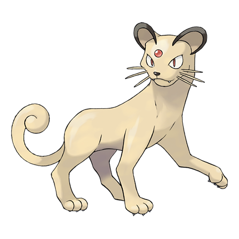

# Persian (Alolan Form) (#0053A)

*Classy Cat Pokemon*

**Type:** Buio
**Abilities:** [[Fur Coat]], [[Technician]], [[Rattled]] *(Hidden)*
**Base HP:** 4

> They were bred for their silky fur and round faces, not for their temperament. This is an extremely proud Pokemon who will look down to anyone but itself, despite this, it’s very popular among Alola’s elite.

---

## Statistiche (Attributes & Limits)

| Attribute | Base / Limit |
|---|---|
| **Strength** | 2/4 |
| **Dexterity** | 3/6 |
| **Vitality** | 2/4 |
| **Special** | 2/5 |
| **Insight** | 2/4 |

---

## Mosse (Learnset)

- **Starter:** [[Scratch|Scratch]], [[Growl|Growl]]
- **Beginner:** [[Bite|Bite]], [[Fake_Out|Fake Out]], [[Fury_Swipes|Fury Swipes]], [[Screech|Screech]]
- **Amateur:** [[Swift|Swift]], [[Switcheroo|Switcheroo]], [[Play_Rough|Play Rough]], [[Captivate|Captivate]], [[Feint_Attack|Feint Attack]], [[Taunt|Taunt]], [[Power_Gem|Power Gem]], [[Slash|Slash]], [[Dark_Pulse|Dark Pulse]]
- **Ace:** [[Assurance|Assurance]], [[Nasty_Plot|Nasty Plot]], [[Night_Slash|Night Slash]], [[Feint|Feint]], [[Quash|Quash]]
- **Pro:** [[Parting_Shot|Parting Shot]], [[Snarl|Snarl]], [[Torment|Torment]]

---
