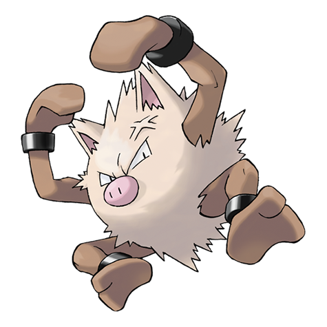

---
title: "Primeape (#0057)"
category: Pokedex
tags: [primeape, kanto, fighting]
image: "assets/images/pokemon/057.png"
---

# Primeape (#0057)

*Pig Monkey Pokemon*

**Type:** Fighting
**Abilities:** [[Vital Spirit]], [[Anger Point]], [[Defiant]] *(Hidden)*
**Base HP:** 4

> It grows angry if you see its eyes and gets angrier if you run. If you fight it will go mad with rage. Not many trainers are capable of handling it, the angrier it gets the less intelligent it becomes.

---

## Statistiche (Attributes & Limits)

| Attribute | Base / Limit |
|---|---|
| **Strength** | 3/6 |
| **Dexterity** | 3/6 |
| **Vitality** | 2/4 |
| **Special** | 2/4 |
| **Insight** | 2/5 |

---

## Mosse (Learnset)

- **Starter:** [[Scratch]]
- **Beginner:** [[Fling]], [[Focus_Energy]], [[Leer]]
- **Amateur:** [[Swagger]], [[Fury_Swipes]], [[Pursuit]], [[Karate_Chop]], [[Seismic_Toss]], [[Screech]], [[Assurance]], [[Rage]]
- **Ace:** [[Final_Gambit]], [[Cross_Chop]], [[Thrash]], [[Stomping_Tantrum]], [[Punishment]], [[Outrage]], [[Close_Combat]]
- **Pro:** [[Night_Slash]], [[Meditate]], [[Overheat]]

---

## Correlati

### Catena Evolutiva
- [[0056_Mankey|Mankey]]
