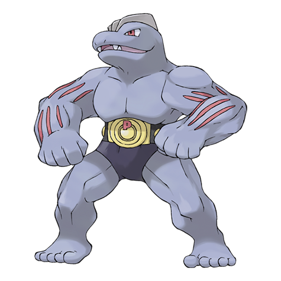

---
title: "Machoke (#0067)"
category: Pokedex
tags: [machoke, kanto, fighting]
image: "assets/images/pokemon/067.png"
---

# Machoke (#0067)

*Superpower Pokemon*

**Type:** Fighting
**Abilities:** [[Guts]], [[No Guard]], [[Steadfast]] *(Hidden)*
**Base HP:** 4

> Even with its strong frame and power, it is a humble and helpful Pokemon. Many of them work for human companies. On their days off you can see them heading to the wild to train together.

---

## Statistiche (Attributes & Limits)

| Attribute | Base / Limit |
|---|---|
| **Strength** | 3/6 |
| **Dexterity** | 2/4 |
| **Vitality** | 2/5 |
| **Special** | 2/4 |
| **Insight** | 2/4 |

---

## Mosse (Learnset)

- **Starter:** [[Low_Kick]], [[Leer]]
- **Beginner:** [[Focus_Energy]], [[Karate_Chop]], [[Foresight]]
- **Amateur:** [[Low_Sweep]], [[Knock_Off]], [[Seismic_Toss]], [[Revenge]], [[Vital_Throw]], [[Dual_Chop]], [[Submission]], [[Wake-Up_Slap]]
- **Ace:** [[Bulk_Up]], [[Cross_Chop]], [[Scary_Face]], [[Dynamic_Punch]]
- **Pro:** [[Meditate]], [[Bullet_Punch]], [[Fire_Punch]]

---

## Correlati

### Catena Evolutiva
- [[0066_Machop|Machop]]
- [[0068_Machamp|Machamp]]
