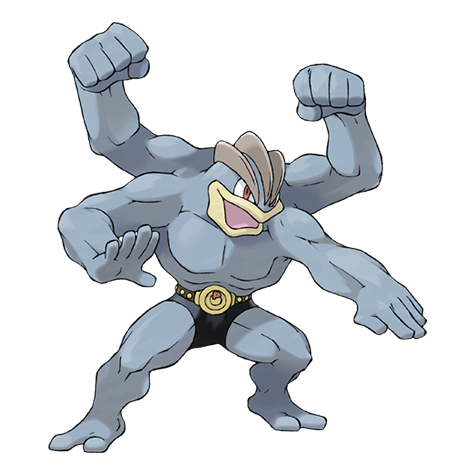
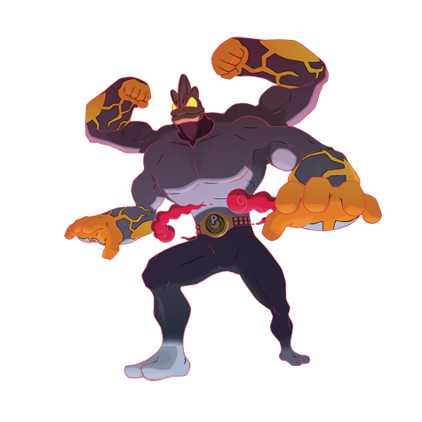

---
title: "Machamp (#0068)"
category: Pokedex
tags: [machamp, kanto, fighting]
image: "assets/images/pokemon/068.png"
---

# Machamp (#0068)

*Superpower Pokemon*

**Type:** Fighting
**Abilities:** [[Guts]], [[No Guard]], [[Steadfast]] *(Hidden)*
**Base HP:** 5

> There are a few roaming in the mountains. Machamp has the power to hurl anything aside. However, trying to do any work that requires care and dexterity may cause its arms to get tangled.

---

## Statistiche (Attributes & Limits)

| Attribute | Base / Limit |
|---|---|
| **Strength** | 3/7 |
| **Dexterity** | 2/4 |
| **Vitality** | 2/5 |
| **Special** | 2/4 |
| **Insight** | 2/5 |

---

## Mosse (Learnset)

- **Starter:** [[Low_Kick]], [[Strength]], [[Leer]]
- **Beginner:** [[Foresight]], [[Karate_Chop]], [[Focus_Energy]]
- **Amateur:** [[Low_Sweep]], [[Wide_Guard]], [[Knock_Off]], [[Seismic_Toss]], [[Revenge]], [[Vital_Throw]], [[Dual_Chop]], [[Submission]], [[Wake-Up_Slap]]
- **Ace:** [[Bulk_Up]], [[Cross_Chop]], [[Scary_Face]], [[Dynamic_Punch]]
- **Pro:** [[Thunder_Punch]], [[Tickle]], [[Close_Combat]]

---

## Forme Speciali

<strong>Machamp (Gigantamax)</strong>

---

## Correlati

### Catena Evolutiva
- [[0066_Machop|Machop]]
- [[0067_Machoke|Machoke]]
