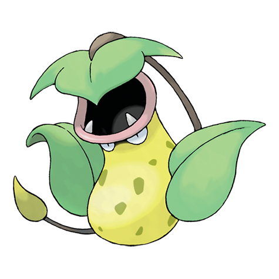

---
title: "Victreebel (#0071)"
category: Pokedex
tags: [victreebel, kanto, grass, poison]
image: "assets/images/pokemon/071.png"
---

# Victreebel (#0071)

*Flycatcher Pokemon*

**Type:** Grass / Poison
**Abilities:** [[Chlorophyll]], [[Gluttony]] *(Hidden)*
**Base HP:** 5

> They live together in small groups at tropical areas. Victreebel uses a sweet honey-like smell to lure and attract prey. They also use their long vines to rustle bushes around. They are territorial and aggressive.

---

## Statistiche (Attributes & Limits)

| Attribute | Base / Limit |
|---|---|
| **Strength** | 3/6 |
| **Dexterity** | 2/5 |
| **Vitality** | 2/4 |
| **Special** | 3/6 |
| **Insight** | 2/5 |

---

## Mosse (Learnset)

- **Starter:** [[Vine_Whip]]
- **Beginner:** [[Swallow]], [[Spit_Up]], [[Stockpile]]
- **Amateur:** [[Sleep_Powder]], [[Sweet_Scent]], [[Razor_Leaf]], [[Leaf_Tornado]]
- **Ace:** [[Leaf_Storm]], [[Leaf_Blade]]
- **Pro:** [[Belch]], [[Power_Whip]], [[Synthesis]]

---

## Correlati

### Catena Evolutiva
- [[0069_Bellsprout|Bellsprout]]
- [[0070_Weepinbell|Weepinbell]]
