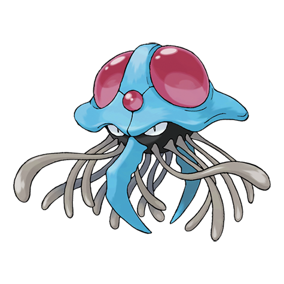

---
title: "Tentacruel (#0073)"
category: Pokedex
tags: [tentacruel, kanto, water, poison]
image: "assets/images/pokemon/073.png"
---

# Tentacruel (#0073)

*Jellyfish Pokemon*

**Type:** Water / Poison
**Abilities:** [[Clear Body]], [[Liquid Ooze]], [[Rain Dish]] *(Hidden)*
**Base HP:** 5

> Lives in rock formations at the bottom of the ocean. It can grow tentacles at will and uses them to immobilize prey. Records exist of a giant Tentacruel that sunk a fleet of pirate ships filled with treasure.

---

## Statistiche (Attributes & Limits)

| Attribute | Base / Limit |
|---|---|
| **Strength** | 2/5 |
| **Dexterity** | 3/6 |
| **Vitality** | 2/4 |
| **Special** | 2/5 |
| **Insight** | 3/7 |

---

## Mosse (Learnset)

- **Starter:** [[Poison_Sting]], [[Supersonic]]
- **Beginner:** [[Constrict]], [[Acid]]
- **Amateur:** [[Brine]], [[Poison_Jab]], [[Toxic_Spikes]], [[Bubble_Beam]], [[Wrap]], [[Acid_Spray]], [[Barrier]], [[Water_Pulse]]
- **Ace:** [[Reflect_Type]], [[Wring_Out]], [[Screech]], [[Hex]], [[Hydro_Pump]], [[Sludge_Wave]]
- **Pro:** [[Giga_Drain]], [[Mirror_Coat]], [[Aqua_Ring]]

---

## Correlati

### Catena Evolutiva
- [[0072_Tentacool|Tentacool]]
