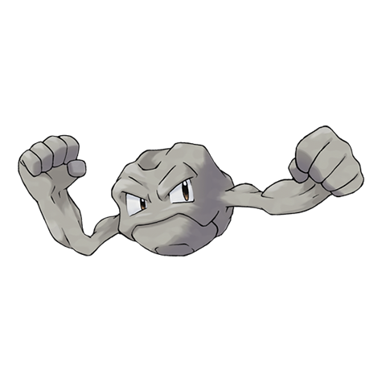

---
title: "Geodude (#0074)"
category: Pokedex
tags: [geodude, kanto, rock, ground]
image: "assets/images/pokemon/074.png"
---

# Geodude (#0074)

*Rock Pokemon*

**Type:** Rock / Ground
**Abilities:** [[Rock Head]], [[Sturdy]], [[Sand Veil]] *(Hidden)*
**Base HP:** 3

> Lives in mountains and caves. It looks indistinguishable from other rocks around. Because of this, many trainers step on them and are attacked. It rolls to move around and eats whatever it finds on the floor.

---

## Statistiche (Attributes & Limits)

| Attribute | Base / Limit |
|---|---|
| **Strength** | 2/5 |
| **Dexterity** | 1/3 |
| **Vitality** | 3/6 |
| **Special** | 1/3 |
| **Insight** | 1/3 |

---

## Mosse (Learnset)

- **Starter:** [[Tackle]], [[Defense_Curl]]
- **Beginner:** [[Mud_Sport]], [[Rock_Polish]], [[Rollout]]
- **Amateur:** [[Magnitude]], [[Rock_Throw]], [[Rock_Blast]], [[Smack_Down]], [[Self_Destruct]], [[Bulldoze]], [[Stealth_Rock]]
- **Ace:** [[Earthquake]], [[Explosion]], [[Double-Edge]], [[Stone_Edge]]
- **Pro:** [[Rock_Climb]], [[Wide_Guard]], [[Sucker_Punch]]

---

## Correlati

### Catena Evolutiva
- [[0075_Graveler|Graveler]]
- [[0076_Golem|Golem]]
