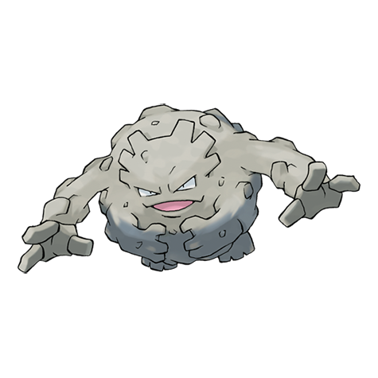

---
title: "Graveler (#0075)"
category: Pokedex
tags: [graveler, kanto, rock, ground]
image: "assets/images/pokemon/075.png"
---

# Graveler (#0075)

*Rock Pokemon*

**Type:** Rock / Ground
**Abilities:** [[Rock Head]], [[Sturdy]], [[Sand Veil]] *(Hidden)*
**Base HP:** 4

> It walks slowly, but it can get a nice speed by rolling downhill. It is good at climbing. Groups of them have been seen clinging from rock formations and cliffs to eat the tasty rocks covered in moss.

---

## Statistiche (Attributes & Limits)

| Attribute | Base / Limit |
|---|---|
| **Strength** | 3/6 |
| **Dexterity** | 1/3 |
| **Vitality** | 3/6 |
| **Special** | 2/4 |
| **Insight** | 2/4 |

---

## Mosse (Learnset)

- **Starter:** [[Tackle]], [[Defense_Curl]]
- **Beginner:** [[Mud_Sport]], [[Rock_Polish]], [[Rollout]]
- **Amateur:** [[Magnitude]], [[Rock_Throw]], [[Rock_Blast]], [[Smack_Down]], [[Self_Destruct]], [[Bulldoze]], [[Stealth_Rock]]
- **Ace:** [[Earthquake]], [[Explosion]], [[Double-Edge]], [[Stone_Edge]]
- **Pro:** [[Rock_Climb]], [[Wide_Guard]], [[Sucker_Punch]]

---

## Correlati

### Catena Evolutiva
- [[0074_Geodude|Geodude]]
- [[0076_Golem|Golem]]

---

## Graveler (Forma Alola) (#0075A)

**Type:** Roccia / Elettro
**Abilities:** [[Magnet Pull]], [[Sturdy]], [[Galvanize]] *(Hidden)*
**Base HP:** 4

| Attribute | Base / Limit |
|---|---|
| **Strength** | 3/6 |
| **Dexterity** | 1/3 |
| **Vitality** | 3/6 |
| **Special** | 2/4 |
| **Insight** | 2/4 |

### Mosse

- **Starter:** [[Tackle|Tackle]], [[Defense_Curl|Defense Curl]]
- **Beginner:** [[Charge|Charge]], [[Rock_Polish|Rock Polish]], [[Rollout|Rollout]]
- **Amateur:** [[Spark|Spark]], [[Rock_Throw|Rock Throw]], [[Smack_Down|Smack Down]], [[Thunder_Punch|Thunder Punch]], [[Self_Destruct|Self Destruct]], [[Stealth_Rock|Stealth Rock]], [[Rock_Blast|Rock Blast]]
- **Ace:** [[Discharge|Discharge]], [[Explosion|Explosion]], [[Double_Edge|Double-Edge]], [[Stone_Edge|Stone Edge]]
- **Pro:** [[Rock_Climb|Rock Climb]], [[Wide_Guard|Wide Guard]], [[Screech|Screech]]
