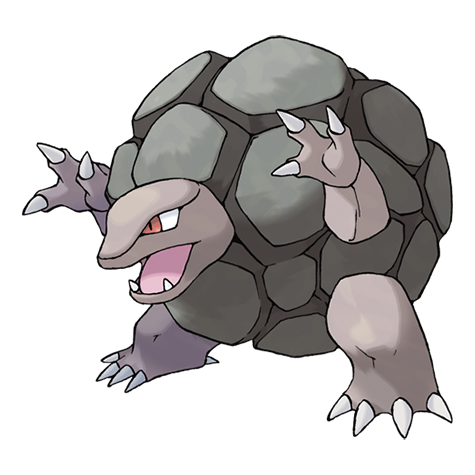

---
title: "Golem (#0076)"
category: Pokedex
tags: [golem, kanto, rock, ground]
image: "assets/images/pokemon/076.png"
---

# Golem (#0076)

*Megaton Pokemon*

**Type:** Rock / Ground
**Abilities:** [[Rock Head]], [[Sturdy]], [[Sand Veil]] *(Hidden)*
**Base HP:** 5

> It is rare to see in the wild since it lives high on the mountains. It withdraws its head and legs as if it were a turtle to roll around. There have been cases of Golem that resist dynamite blasts unscathed.

---

## Statistiche (Attributes & Limits)

| Attribute | Base / Limit |
|---|---|
| **Strength** | 3/8 |
| **Dexterity** | 2/4 |
| **Vitality** | 3/7 |
| **Special** | 2/4 |
| **Insight** | 2/4 |

---

## Mosse (Learnset)

- **Starter:** [[Tackle]], [[Defense_Curl]]
- **Beginner:** [[Mud_Sport]], [[Rock_Polish]], [[Steamroller]]
- **Amateur:** [[Magnitude]], [[Rock_Throw]], [[Rock_Blast]], [[Smack_Down]], [[Self_Destruct]], [[Bulldoze]], [[Stealth_Rock]]
- **Ace:** [[Earthquake]], [[Explosion]], [[Double-Edge]], [[Stone_Edge]], [[Heavy_Slam]]
- **Pro:** [[Iron_Defense]], [[Superpower]], [[Thunder_Punch]]

---

## Correlati

### Catena Evolutiva
- [[0074_Geodude|Geodude]]
- [[0075_Graveler|Graveler]]
