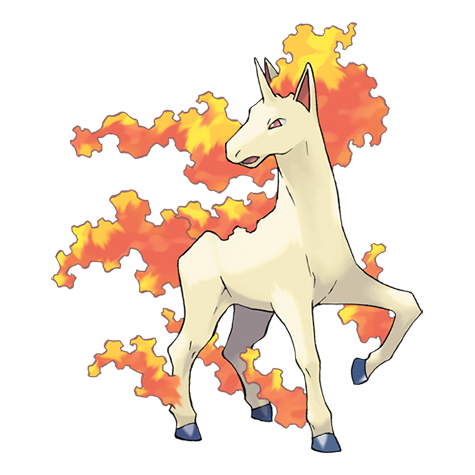

---
title: "Rapidash (#0078)"
category: Pokedex
tags: [rapidash, kanto, fire]
image: "assets/images/pokemon/078.png"
---

# Rapidash (#0078)

*Fire Horse Pokemon*

**Type:** Fire
**Abilities:** [[Run_Away]], [[Flash Fire]], [[Flame Body]] *(Hidden)*
**Base HP:** 4

> It lives happily on prairies. It loves speed competitions - a herd can often be seen running alongside a train. It can regulate the heat of its mane as to let its trainer ride it, but only if it trusts him enough.

---

## Statistiche (Attributes & Limits)

| Attribute | Base / Limit |
|---|---|
| **Strength** | 3/6 |
| **Dexterity** | 3/6 |
| **Vitality** | 2/5 |
| **Special** | 2/5 |
| **Insight** | 2/5 |

---

## Mosse (Learnset)

- **Starter:** [[Ember]], [[Growl]]
- **Beginner:** [[Quick_Attack]], [[Tail_Whip]], [[Flame_Wheel]], [[Take_Down]]
- **Amateur:** [[Poison_Jab]], [[Stomp]], [[Flame_Charge]], [[Fire_Spin]], [[Fury_Attack]], [[Inferno]], [[Megahorn]]
- **Ace:** [[Agility]], [[Fire_Blast]], [[Bounce]], [[Flare_Blitz]]
- **Pro:** [[Horn_Drill]], [[Morning_Sun]], [[Drill_Run]]

---

## Correlati

### Catena Evolutiva
- [[0077_Ponyta|Ponyta]]
