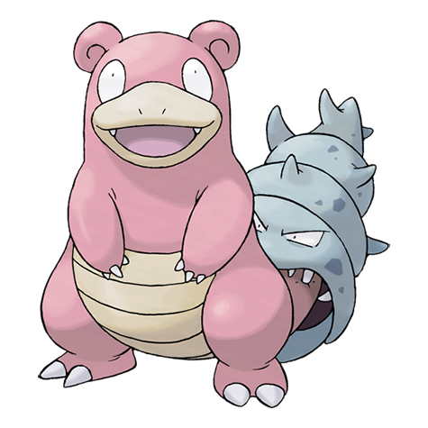
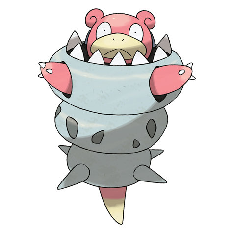

---
title: "Slowbro (#0080)"
category: Pokedex
tags: [slowbro, kanto, water, psychic]
image: "assets/images/pokemon/080.png"
---

# Slowbro (#0080)

*Hermit Crab Pokemon*

**Type:** Water / Psychic
**Abilities:** [[Oblivious]], [[Own Tempo]], [[Regenerator]] *(Hidden)*
**Base HP:** 5

> This Pokemon fused with a Shellder that bit into its tail. It’s a slow swimmer and doesn’t react to pain but Shellder tends to keep it out of trouble.

---

## Statistiche (Attributes & Limits)

| Attribute | Base / Limit |
|---|---|
| **Strength** | 2/5 |
| **Dexterity** | 1/3 |
| **Vitality** | 4/6 |
| **Special** | 3/6 |
| **Insight** | 2/5 |

---

## Mosse (Learnset)

- **Starter:** [[Yawn]], [[Tackle]]
- **Beginner:** [[Curse]], [[Growl]], [[Water_Gun]]
- **Amateur:** [[Confusion]], [[Disable]], [[Headbutt]], [[Water_Pulse]], [[Zen_Headbutt]], [[Slack_Off]], [[Withdraw]], [[Amnesia]]
- **Ace:** [[Psychic]], [[Rain_Dance]], [[Psych_Up]], [[Heal_Pulse]]
- **Pro:** [[Aqua_Tail]], [[Belly_Drum]], [[Future_Sight]]

---

## Forme Speciali

### Mega Slowbro

**Type:** Water / Psychic  
**Ability:** [[Shell_Armor|Shell Armor]]  
**Base HP:** 5  ·  **Suggested Rank:** Ace  
**Height:** 2m / 6'07"  ·  **Weight:** 120kg / 264lbs

> With the power of the Mega Stone the Shellder on its tail becomes a bulletproof armor that swallows its host's whole body. Slowpoke doesn't seem to mind and looks pretty comfy inside.

 

---

## Correlati

### Catena Evolutiva
- [[0079_Slowpoke|Slowpoke]]

---

## Slowbro (Forma Galar) (#0080G)

**Type:** Veleno / Psico
**Abilities:** [[Quick Draw]], [[Own Tempo]], [[Regenerator]] *(Hidden)*
**Base HP:** 4

| Attribute | Base / Limit |
|---|---|
| **Strength** | 3/6 |
| **Dexterity** | 1/3 |
| **Vitality** | 3/6 |
| **Special** | 3/6 |
| **Insight** | 2/4 |

### Mosse

- **Starter:** [[Shell_Side_Arm|Shell Side Arm]], [[Withdraw|Withdraw]], [[Tackle|Tackle]]
- **Beginner:** [[Curse|Curse]], [[Growl|Growl]], [[Acid_Spray|Acid Spray]], [[Yawn|Yawn]]
- **Amateur:** [[Confusion|Confusion]], [[Disable|Disable]], [[Water_Pulse|Water Pulse]], [[Headbutt|Headbutt]], [[Zen_Headbutt|Zen Headbutt]], [[Amnesia|Amnesia]]
- **Ace:** [[Surf|Surf]], [[Slack_Off|Slack Off]], [[Psychic|Psychic]], [[Psych_Up|Psych Up]], [[Rain_Dance|Rain Dance]], [[Heal_Pulse|Heal Pulse]]
- **Pro:** [[Flamethrower|Flamethrower]], [[Expanding_Force|Expanding Force]], [[Venoshock|Venoshock]]
