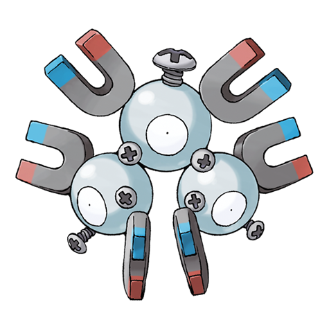

---
title: "Magneton (#0082)"
category: Pokedex
tags: [magneton, kanto, electric, steel]
image: "assets/images/pokemon/082.png"
---

# Magneton (#0082)

*Magnet Pokemon*

**Type:** Electric / Steel
**Abilities:** [[Magnet Pull]], [[Sturdy]], [[Analytic]] *(Hidden)*
**Base HP:** 4

> Sometimes three Magnemites fuse into this Pokemon; other times a single one sprouts two others. This species is greatly affected by magnetic fields. Magnetons are eager to please their trainers.

---

## Statistiche (Attributes & Limits)

| Attribute | Base / Limit |
|---|---|
| **Strength** | 2/4 |
| **Dexterity** | 2/5 |
| **Vitality** | 3/6 |
| **Special** | 3/7 |
| **Insight** | 2/6 |

---

## Mosse (Learnset)

- **Starter:** [[Supersonic]], [[Tackle]]
- **Beginner:** [[Tri_Attack]], [[Thunder_Shock]], [[Sonic_Boom]], [[Electric_Terrain]]
- **Amateur:** [[Light_Screen]], [[Thunder_Wave]], [[Magnet_Bomb]], [[Spark]], [[Mirror_Shot]], [[Metal_Sound]], [[Electro_Ball]], [[Flash_Cannon]], [[Screech]], [[Magnet_Rise]], [[Lock-On]]
- **Ace:** [[Discharge]], [[Gyro_Ball]], [[Zap_Cannon]]
- **Pro:** [[Gravity]], [[Iron_Defense]], [[Signal_Beam]]

---

## Correlati

### Catena Evolutiva
- [[0081_Magnemite|Magnemite]]
