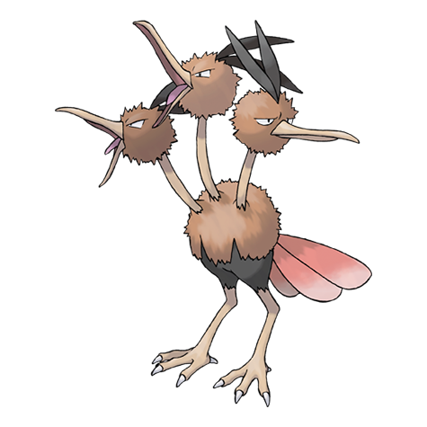

---
title: "Dodrio (#0085)"
category: Pokedex
tags: [dodrio, kanto, normal, flying]
image: "assets/images/pokemon/085.png"
---

# Dodrio (#0085)

*Triple Bird Pokemon*

**Type:** Normal / Flying
**Abilities:** [[Run_Away]], [[Early Bird]], [[Tangled Feet]] *(Hidden)*
**Base HP:** 4

> A third head comes to change the dynamic the two original had. It is common to see the three heads fighting. Each one has its own personality, but when they work as a team they can be very powerful.

---

## Statistiche (Attributes & Limits)

| Attribute | Base / Limit |
|---|---|
| **Strength** | 3/6 |
| **Dexterity** | 3/6 |
| **Vitality** | 2/5 |
| **Special** | 2/4 |
| **Insight** | 2/4 |

---

## Mosse (Learnset)

- **Starter:** [[Peck]], [[Growl]]
- **Beginner:** [[Quick_Attack]], [[Rage]]
- **Amateur:** [[Fury_Attack]], [[Pursuit]], [[Pluck]], [[Uproar]], [[Acupressure]], [[Tri_Attack]], [[Swords_Dance]], [[Agility]]
- **Ace:** [[Jump_Kick]], [[Drill_Peck]], [[Endeavor]], [[Thrash]]
- **Pro:** [[Mirror_Move]], [[Feint_Attack]], [[Brave_Bird]]

---

## Correlati

### Catena Evolutiva
- [[0084_Doduo|Doduo]]
