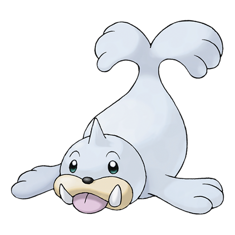

---
title: "Seel (#0086)"
category: Pokedex
tags: [seel, kanto, water]
image: "assets/images/pokemon/086.png"
---

# Seel (#0086)

*Sea Lion Pokemon*

**Type:** Water
**Abilities:** [[Thick Fat]], [[Hydration]], [[Ice Body]] *(Hidden)*
**Base HP:** 3

> A Pokemon that lives on icebergs. It swims in the sea using the point on its head to break up the ice. It sleeps a lot during the day, being most active at dawn when the temperature starts to cool.

---

## Statistiche (Attributes & Limits)

| Attribute | Base / Limit |
|---|---|
| **Strength** | 2/4 |
| **Dexterity** | 2/4 |
| **Vitality** | 2/4 |
| **Special** | 2/4 |
| **Insight** | 2/5 |

---

## Mosse (Learnset)

- **Starter:** [[Water_Sport]], [[Growl]]
- **Beginner:** [[Encore]], [[Icy_Wind]], [[Take_Down]]
- **Amateur:** [[Ice_Shard]], [[Rest]], [[Aqua_Ring]], [[Aurora_Beam]], [[Aqua_Jet]], [[Brine]], [[Headbutt]], [[Dive]]
- **Ace:** [[Aqua_Tail]], [[Ice_Beam]], [[Safeguard]], [[Hail]]
- **Pro:** [[Fake_Out]], [[Lick]], [[Signal_Beam]]

---

## Correlati

### Catena Evolutiva
- [[0087_Dewgong|Dewgong]]
