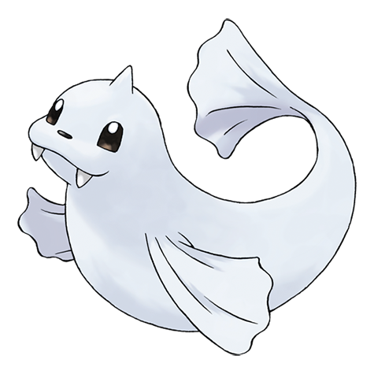

---
title: "Dewgong (#0087)"
category: Pokedex
tags: [dewgong, kanto, water, ice]
image: "assets/images/pokemon/087.png"
---

# Dewgong (#0087)

*Sea Lion Pokemon*

**Type:** Water / Ice
**Abilities:** [[Thick Fat]], [[Hydration]], [[Ice Body]] *(Hidden)*
**Base HP:** 4

> Its body is covered with a pure white fur. The colder the weather, the more active it becomes. It hunts at night and it’s excellent at catching fish Pokemon. It is also very intelligent and playful.

---

## Statistiche (Attributes & Limits)

| Attribute | Base / Limit |
|---|---|
| **Strength** | 2/5 |
| **Dexterity** | 2/5 |
| **Vitality** | 2/5 |
| **Special** | 2/5 |
| **Insight** | 3/6 |

---

## Mosse (Learnset)

- **Starter:** [[Signal_Beam]], [[Growl]]
- **Beginner:** [[Encore]], [[Icy_Wind]], [[Take_Down]]
- **Amateur:** [[Ice_Shard]], [[Rest]], [[Aqua_Ring]], [[Aurora_Beam]], [[Aqua_Jet]], [[Brine]], [[Sheer_Cold]], [[Headbutt]], [[Dive]]
- **Ace:** [[Aqua_Tail]], [[Ice_Beam]], [[Safeguard]], [[Hail]]
- **Pro:** [[Avalanche]], [[Perish_Song]], [[Horn_Drill]]

---

## Correlati

### Catena Evolutiva
- [[0086_Seel|Seel]]
